# Processamento de Linguagem Natural  - Módulo 6 - Inteli
## Foster
João Pedro Brandão de Moura, Lucas Oliveira de Medeiros Galvão, Luiza Rodrigues Santana, Pedro Faria Santos, Ricardo Baumgart Magalhães de Novaes, Sophia Leite da Nóbrega e Yan Mendonça Coutinho.

## Sumário
[1. Introdução](#c1) <br>
[2. Entendimento do Negócio](#c2)  <br>
&nbsp;&nbsp;&nbsp;&nbsp;[2.1. Matriz de avaliação de valor Oceano Azul](#c2.1)  <br>
&nbsp;&nbsp;&nbsp;&nbsp;[2.2. Matriz de Risco](#c2.2)  <br>
&nbsp;&nbsp;&nbsp;&nbsp;[2.3. Canvas Proposta de Valor](#c2.3)  <br>
&nbsp;&nbsp;&nbsp;&nbsp;[2.4. Análise financeira do projeto](#c2.4)  <br>
[3. Entendimento do Usuário](#c3) <br>
&nbsp;&nbsp;&nbsp;&nbsp;[3.1. Personas](#c3.1) <br>
&nbsp;&nbsp;&nbsp;&nbsp;[3.2. Mapa de Empatia](#c3.2) <br>
&nbsp;&nbsp;&nbsp;&nbsp;[3.3. User Stories](#c3.3) <br>
[4. Análise Descritiva](#c4)  <br>
&nbsp;&nbsp;&nbsp;&nbsp;[4.1. Gráficos](#c4.1) <br>
&nbsp;&nbsp;&nbsp;&nbsp;[4.2. Conclusões](#c4.2) <br>
[5. Pré-processamento](#c5)  <br>
&nbsp;&nbsp;&nbsp;&nbsp;[5.1. Tokenização](#c5.1) <br>
&nbsp;&nbsp;&nbsp;&nbsp;[5.2. Tags POS (_Part Of Speech_)](#c5.2) <br>
&nbsp;&nbsp;&nbsp;&nbsp;[5.3. Remoção das _Stop Words_](#c5.3) <br>
&nbsp;&nbsp;&nbsp;&nbsp;[5.4. Lemmatização](#c5.4) <br>
&nbsp;&nbsp;&nbsp;&nbsp;[5.5. Pipeline](#c5.5) <br>
[6. Modelo de Bag of Words (IPYNB)](#c6)  <br>
&nbsp;&nbsp;&nbsp;&nbsp;[6.1. Métodos](#c6.1) <br>
&nbsp;&nbsp;&nbsp;&nbsp;[6.1.1. CountVectorizer (scikit-learn)](#c6.1.1) <br>
&nbsp;&nbsp;&nbsp;&nbsp;[6.1.2. TfidVectorizer (scikit-learn)](#c6.1.2) <br>
&nbsp;&nbsp;&nbsp;&nbsp;[6.2. Naive Bayes](#c6.2) <br>
&nbsp;&nbsp;&nbsp;&nbsp;[6.3. Regressão Logística](#c6.3) <br>
&nbsp;&nbsp;&nbsp;&nbsp;[6.4. Resultados](#c6.4) <br>
[7. Modelo utilizando Word2Vec](#c7) <br>
&nbsp;&nbsp;&nbsp;&nbsp;[7.1. Naive Bayes](#c7.1) <br>
&nbsp;&nbsp;&nbsp;&nbsp;[7.2. Random Forest](#c7.2) <br>
&nbsp;&nbsp;&nbsp;&nbsp;[7.3. Resultados](#c7.3) <br>
&nbsp;&nbsp;&nbsp;&nbsp;[7.3.1. Testes](#c7.3.1) <br>
&nbsp;&nbsp;&nbsp;&nbsp;[7.3.2. Métricas](#c7.3.2) <br>
[8. Modelo utilizando TinyBERT](#c8) <br>
&nbsp;&nbsp;&nbsp;&nbsp;[8.1. Rede Neural](#c8.1) <br>
&nbsp;&nbsp;&nbsp;&nbsp;[8.2. Métodos](#c8.2) <br>
&nbsp;&nbsp;&nbsp;&nbsp;[8.3. Resultados](#c8.3) <br>
[9. Comparação dos Modelos](#c9) <br>
&nbsp;&nbsp;&nbsp;&nbsp;[9.1. Modelos Avaliados](#c9.1) <br>
&nbsp;&nbsp;&nbsp;&nbsp;[9.2. Resultados](#c9.2) <br>
[10. Desenvolvimento da API](#c10) <br>
&nbsp;&nbsp;&nbsp;&nbsp;[10.1. Arquitetura Simplificada da API](#c10.1) <br>
&nbsp;&nbsp;&nbsp;&nbsp;[10.2. Métodos](#c10.2) <br>
&nbsp;&nbsp;&nbsp;&nbsp;[10.3. Resultados](#c10.3) <br>
&nbsp;&nbsp;&nbsp;&nbsp;[10.4. Análise](#c10.4) <br>
[11. Diagrama UML da solução](#c11) <br>
[12. Deploy](#c12) <br>
&nbsp;&nbsp;&nbsp;&nbsp;[12.1. Alerta no Slack](#c12.1) <br>
&nbsp;&nbsp;&nbsp;&nbsp;[12.1.1. Render](#c12.1.1) <br>
&nbsp;&nbsp;&nbsp;&nbsp;[12.1.2. Métodos](#c12.1.2) <br>
&nbsp;&nbsp;&nbsp;&nbsp;[12.1.3. Resultados](#c12.1.3) <br>
&nbsp;&nbsp;&nbsp;&nbsp;[12.2. Modelo de Classificação](#c12.2) <br>
&nbsp;&nbsp;&nbsp;&nbsp;[12.2.1. HuggingFace](#c12.2.1) <br>
&nbsp;&nbsp;&nbsp;&nbsp;[12.2.2. Métodos](#c12.2.2) <br>
&nbsp;&nbsp;&nbsp;&nbsp;[12.2.3. Resultados](#c12.2.3) <br>
[13. Conclusão e Sugestões de Melhorias](#c13) <br>
[14. Referências](#c14)
<br>

# <a name="c1"></a>1. Introdução
&emsp;&emsp;Neste projeto, desenvolvemos um sistema de análise de sentimentos para a Uber, com o objetivo de classificar os comentários dos usuários como positivos, negativos ou neutros. A principal meta é fornecer insights valiosos para a melhoria contínua dos serviços da empresa, identificando pontos fortes e áreas que precisam de atenção.

&emsp;&emsp;Inicialmente, recebemos da Uber um banco de dados contendo aproximadamente 3200 linhas de comentários de usuários. Em seguida, realizamos o pré-processamento dos dados para limpar e preparar os textos para a análise. Esta etapa envolveu a remoção de palavras irrelevantes (stopwords), lematização (redução das palavras à sua forma básica), stemming (redução das palavras aos seus radicais) e normalização dos textos.

&emsp;&emsp;Após o pré-processamento, fizemos uma análise exploratória dos dados para entender melhor a distribuição dos sentimentos, identificar padrões e detectar possíveis outliers. Utilizamos gráficos e estatísticas descritivas para facilitar essa compreensão.

&emsp;&emsp;Para a modelagem, utilizamos diferentes técnicas de vetorização, como Bag of Words (BoW), TF-IDF e Word2Vec, e treinamos vários modelos de machine learning, incluindo Naive Bayes e Random Forest. Além disso, implementamos o TinyBERT, uma versão compacta do modelo BERT, conhecida por sua eficiência em tarefas de processamento de linguagem natural (PLN).

&emsp;&emsp;Os modelos foram avaliados utilizando métricas como acurácia, precisão, recall e F1-score para assegurar a robustez dos resultados. A validação cruzada foi aplicada para garantir que os modelos generalizassem bem em dados não vistos.

&emsp;&emsp;Desenvolvemos também uma API utilizando Flask, permitindo a integração do sistema de análise de sentimentos com outras aplicações da Uber. A API possui endpoints que permitem a classificação de novos comentários em tempo real. Rigorosos testes unitários e de integração foram realizados para garantir a performance e precisão da API em diferentes cenários.

&emsp;&emsp;Concluímos que o sistema de análise de sentimentos desenvolvido é uma ferramenta poderosa para a Uber entender melhor a percepção dos usuários sobre seus serviços. Com os insights obtidos, a empresa pode tomar decisões informadas para melhorar a satisfação do cliente e aprimorar suas operações. A combinação de modelos avançados de machine learning com uma API robusta garante a eficiência e escalabilidade da solução, pronta para ser utilizada em um ambiente de produção.

# <a name="c2"></a>2. Entendimento do Negócio
## <a name="c2.1"></a>2.1. Matriz de avaliação de valor Oceano Azul

&emsp;&emsp;Esta seção se trata da matriz oceano azul, um processo muito importante na construção de soluções que buscam inovar o mercado e explorar setores que estão com dores ainda não atendidas por outros produtos. Esse setor não abrangido pelo mercado é chamado de Oceano Azul, enquanto o atendido é chamado de Oceano Vermelho (por conta da quantidade de concorrentes), segundo os escritores Renée Mauborgne e W. Chan Kim. Por fim, a matriz tem por vez a função de pontuar de maneira objetiva os atributos dos outros produtos no mercado e definir quais deles devemos eliminar, diminuir, aumentar e criar, para que assim o produto chegue ao usuário que mais necessita de maneira inovadora.

&emsp;&emsp;Para esta análise, serão considerados 8 aspectos sobre os produtos do mercado. Tais características foram escolhidas e avaliadas com base na entrevista realizada com o cliente. Dito isso, elencou-se os seguintes atributos:

- Preço;
- Personalização;
- Recorrência dos relatórios;
- Escalabilidade;
- Exclusividade;
- Integração;
- Interface;
- Quantidade de funcionalidades nativas.

&emsp;&emsp;Essas qualidades vão de 0 a 3, sendo:

0. Não se aplica / Não existe;
1. Baixo;
2. Médio;
3. Alto.

&emsp;&emsp;Por fim, para essa análise foi considerado a solução que está sendo desenvolvida e analisada (Emotion) e 3 outros concorrentes: 

- **[Mention](https://mention.com/en/):** Solução de *Software As a Service* (SAS) que compila diversas menções da empresa ao longo da Internet. Nela é possível monitorar o que está sendo dito (sobre sua marca e sobre concorrentes), realizar posts em diversas redes sociais e receber qual a percepção que estão tendo sobre seus produtos (feito manualmente);
- **[Smelter](https://smelter.ai/pt):** SAS que coleta e analisa posts nas mídias sociais que contém as palavras-chaves, por exemplo o nome do seu produto. Com essa ferramenta, é possível filtrar por palavras e receber relatórios automáticos que contém os sentimentos, posts representativos, estatísticas, palavras associadas, redes sociais e autores que mais se relacionam e geram dados sobre sua marca;
- **[Brand24](https://brand24.com/):** Sistema de análise de redes sociais que contempla um SAS e a integração com diversas plataformas. Oferece diversas funcionalidades que abrangem a coleta em diversas fontes, análises, funcionalidades de processamento de linguagem natural (incluindo análise de sentimento, emoção, tendência, percepções e detecção de anomalias), relatórios, alertas, filtragem, dashboard, aplicação mobile, integrações e suporte pós-venda.

&emsp;&emsp;Elas foram avaliadas, sob a perspectiva do cliente, em cada atributo e descritas nestes quadros:

### Preço

&emsp;&emsp;Nesse contexto, quanto menor o preço pago, melhor será a classificação, já que a matriz transpõem a percepção de valor do produto sob o ponto de vista do cliente. Ademais, o método de cobrança do serviço também é um ponto considerado, pois métodos de cobrança que utilizam de uma taxa (ex: quantidade de uso) é negativo para a Uber enquanto mensalidades fixas é um ponto positivo devido ao tamanho da empresa.

<h6 align="center"> Tabela 1 </h6>

|  | Smelter | Brand24 | Mention | Emotion |
| --- | --- | --- | --- | --- |
| Nota | 1 | 2 | 2 | 3 |
| Justificativa | Não contém os preços e o método de pagamento de forma explícita no site. Entretanto, apresenta 4 tipos de planos de pagamento. | O Brand24 apresenta 4 planos mensais que são pagos mensalmente. | O Mention apresenta 4 planos de preço de mensalidade fixa. Sendo que o ultimo é realizado sob consulta. | É uma solução open-source e, portanto, é possível ser adquirida gratuitamente. |

### Personalização

&emsp;&emsp;Essa característica avalia a facilidade e a possibilidade de alteração do produto segundo as necessidades do cliente. Essas demandas são abrangidas na TAPI e incluem (e não se limitando) a integração com o Slack, integração com sistemas já existentes e envio de relatórios que indiquem o sentimento, trend, tipo, intensidade captada, comentário de exemplo e quantidade de posts similares.

<h6 align="center"> Tabela 2 </h6>

|  | Smelter | Brand24 | Mention | Emotion |
| --- | --- | --- | --- | --- |
| Nota | 0 | 1 | 0 | 3 |
| Justificativa | Não é personalizável | É possível criar API’s que possibilitam a integração com sistemas personalizados da Uber. Entretanto, isso não altera o produto da Brand24 diretamente. | Não é personalizável | Por ser Open-Source, é totalmente personalizável e poderá ter diversas distribuições com diferentes funcionalidades. |

### Recorrência dos relatórios

&emsp;&emsp;A recorrência se refere a periodicidade em que as análises são feitas e a possibilidade de alteração dessa frequência. Dado isso, as soluções foram avaliadas da seguinte forma:

<h6 align="center"> Tabela 3 </h6>

|  | Smelter | Brand24 | Mention | Emotion |
| --- | --- | --- | --- | --- |
| Nota | 2 | 1 | 0 | 3 |
| Justificativa | Na Smelter é possível receber relatórios automáticos. Entretanto, não é dito a regularidade desses relatórios. | A maior recorrência anunciada em que os relatórios podem acontecer é a cada 24h. | Não é anunciado que a Mention é capaz de realizar relatórios. | No Emotion, é possível ajustar a recorrência dos relatórios para qualquer frequência. |

### Escalabilidade

&emsp;&emsp;O critério de escalabilidade abrange 2 aspectos. Primeiramente, o produto analisado deve ser capaz de ser utilizado utilizado em massa em diversos países. Por outro lado, deve ser financeiramente viável ao aumentar o seu uso.

<h6 align="center"> Tabela 4 </h6>

|  | Smelter | Brand24 | Mention | Emotion |
| --- | --- | --- | --- | --- |
| Nota | 0 | 1 | 2 | 3 |
| Justificativa | Contém limitações em relação a quantidade de projetos, menções e contas que podem ser geridas. | Não é possível analisar mias de 100 mil menções ao mês. Entretanto, os outros recursos podem ser atualizados. | Não informa qual a quantidade máxima de alertas e menções que podem ser criadas. Por outro lado, a quantidade de usuários e contas em redes sociais é ilimitada no plano mais caro. | Por ser um projeto tecnológico e Open-Source, a escalabilidade é alta e depende apenas dos recursos financeiros investidos para arcar com os custos.  |

### Exclusividade

&emsp;&emsp;A priori, é necessário compreender que a tecnologia é um item valioso para a Uber, já que é essa é a base para os seus produtos e diferenciais em frente a concorrência. Logo, uma solução que seja exclusiva e focada nessa empresa é valorizável e terá um maior peso na análise desse atributo. 

<h6 align="center"> Tabela 5 </h6>

|  | Smelter | Brand24 | Mention | Emotion |
| --- | --- | --- | --- | --- |
| Nota | 0 | 0 | 0 | 2 |
| Justificativa | Não é exclusivo | Não é exclusivo | Não é exclusivo | É exclusivamente focado nas necessidades da Uber. Entretanto não é confidencial e pode ser copiado por outras empresas. |

### Integração

&emsp;&emsp;É essencial para a Uber que a solução possa se conectar os diferentes sistemas da empresa. Além disso, é importante que ela apresente os resultados seguindo o padrão utilizado atualmente pela equipe de monitoramento das redes sociais.

<h6 align="center"> Tabela 6 </h6>

|  | Smelter | Brand24 | Mention | Emotion |
| --- | --- | --- | --- | --- |
| Nota | 0 | 2 | 0 | 3 |
| Justificativa | Não consegue se conectar a diferentes soluções. | Consegue se conectar a diferentes soluções por meio da criação de API’s. Contudo, isso é cobrado adicionalmente. | Não consegue se conectar a diferentes soluções | Por ser Open-Source, é fácil criar distribuições que se conectem com os sistemas já existentes. |

### Interface

&emsp;&emsp;A interface é por onde o usuário interage com a plataforma e visualiza as informações. É essencial que ela contenhas as principais informações e que as apresente intuitivamente para o usuário. Por fim, para o parceiro é benéfico que essa interface seja uma dashboard que mostre o estado atual das redes sociais em relação a marca.

<h6 align="center"> Tabela 7 </h6>

|  | Smelter | Brand24 | Mention | Emotion |
| --- | --- | --- | --- | --- |
| Nota | 3 | 3 | 3 | 0 |
| Justificativa | Apresenta dashboard que demonstra o estado da rede. | Apresenta dashboard que demonstra o estado da rede.  | Apresenta dashboard que demonstra o estado da rede.  | Não apresenta nenhuma interface. |

### Quantidade de funcionalidades nativas

&emsp;&emsp;Essa característica é quantidade e qualidade das funções já existentes no produto em relação ao que a Uber necessita. Desse modo, um produto que atenda todos os critérios será classificado como alto (3).

<h6 align="center"> Tabela 8 </h6>

|  | Smelter | Brand24 | Mention | Emotion |
| --- | --- | --- | --- | --- |
| Nota  | 2 | 3 | 2 | 1 |
| Justificativa | Há a análise de sentimento e a criação de relatórios. | Contém a maioria das funcionalidades pedidas. Por exemplo, integração com o Slack, alertas, relatórios recorrentes, possibilidade de integração e análise de emoção. | Apresenta a criação de alertas e um dashboard que apresenta as informações em tempo real. | Contém a análise de sentimentos, envio de alertas e relatórios. |

### Conclusão
&emsp;&emsp;Ao comparar todos esses atributos, justificativas e notas é possível consolidar essa informação nesta imagem:
<h6 align="center"> Imagem 1: Matriz Oceano Azul </h6>

<div align="center">
	
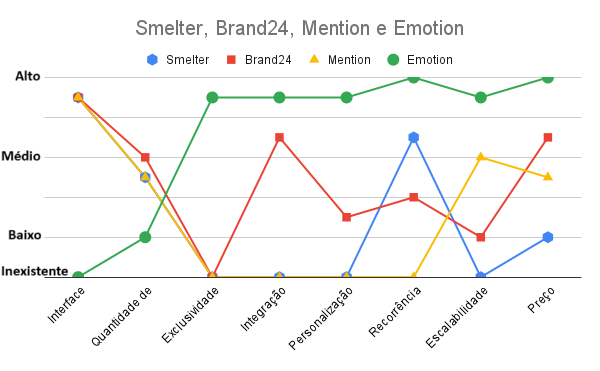
</div>

<h6 align="center"> Fonte: Elaborado pelo grupo Foster </h6>


&emsp;&emsp;A partir disso, é possível elencar, da seguinte forma, o valor que o cliente percebe em relação aos diferenciais da solução Emotion:
- **Eliminar:** A interface foi eliminada, de modo a possibilitar que o cliente construa sua própria interface e integre facilmente a solução;
- **Reduzir:** A quantidade de funcionalidades nativas foi reduzida a fim de incentivar e faciltar que criem diversas distribuições desse software a partir dessa versão inicial;
- **Aumentar:** Em relação a concorrência, os valores o preço, a facilidade de integração, a personalização e a escalabilidade foi aumentada, sob a ótica do parceiro, devido aos fatores supracitados;
- **Criar:** Por fim, o fato de ser open source possibilita que a recorrência dos relatórios seja totalmente personalizável. Ademais, isso impacta diretamente na exclusividade da solução, já que todas as funcionalidades (como o processamento de linguagem natural) são totalmente feitos com base na Uber.

&emsp;&emsp;Portanto, é visível, através da análise da matriz de oceano azul, o valor que o Emotion agrega ao parceiro desse projeto. 

## <a name="c2.2"></a>2.2. Matriz de Risco

&emsp;&emsp;A matriz de riscos é uma ferramenta fundamental no gerenciamento de projetos, amplamente utilizada para identificar, avaliar e priorizar os riscos que podem afetar o sucesso de uma iniciativa. Compreender a importância da matriz de riscos pode ser crucial para o desenvolvimento de habilidades de gerenciamento de projetos e para garantir o êxito em projetos acadêmicos e profissionais. Nesta parte da documentação, exploraremos os conceitos básicos da matriz de riscos, sua aplicação prática e como ela pode contribuir para mitigar ameaças e aproveitar oportunidades em projetos de diferentes naturezas.

<h6 align="center"> Imagem 2: Matriz de Riscos Completa </h6>

<div align="center">
	
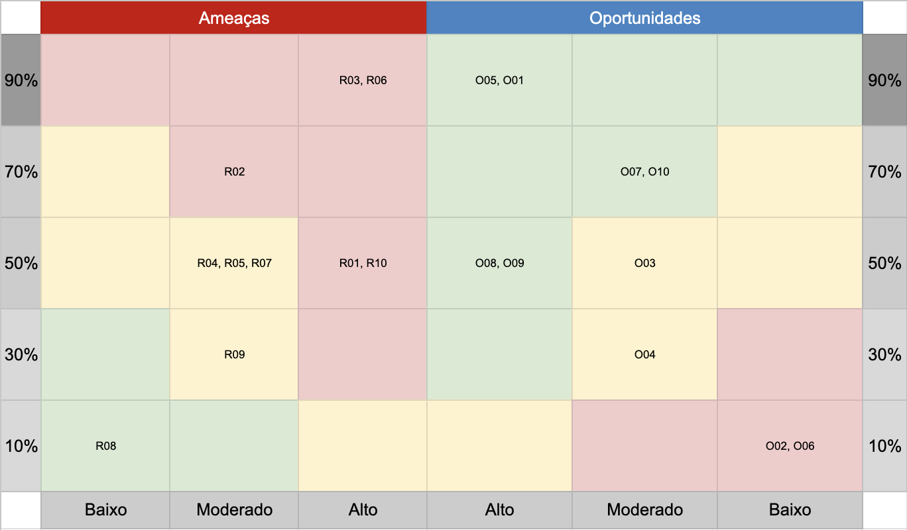
</div>

<h6 align="center"> Fonte: Elaborado pelo grupo Foster </h6>

### Justificativas dos Riscos

1. **R01 - Má gestão de tempo gerando atraso nas entregas:** Este risco pode ocorrer se não houver um planejamento adequado das atividades e uma supervisão eficiente do progresso do projeto.
2. **R02 - Má comunicação do grupo gerando atraso nas entregas:** Se a comunicação entre os membros não for clara e eficaz, podem ocorrer mal-entendidos, retrabalho e, consequentemente, atrasos nas entregas.
3. **R03 - Falta de membros por conta de doenças:** A ausência de membros devido a doenças pode impactar significativamente o progresso do projeto, especialmente se não houver um plano de contingência para lidar com essa situação.
4. **R04 - Má utilização do GitHub:** Se os membros não estiverem familiarizados ou não utilizarem corretamente a plataforma de colaboração (GitHub), pode haver dificuldades na coordenação e no versionamento do código.
5. **R05 - Déficit técnico:** A falta de habilidades técnicas necessárias para concluir as tarefas pode levar a atrasos ou a entregas de baixa qualidade.
6. **R06 - Centralização de tarefas:** Se as tarefas estiverem centralizadas em poucos membros, pode haver sobrecarga e gargalos no fluxo de trabalho.
7. **R07 - Afastamento do objetivo principal do projeto:** Se não houver um foco claro nos objetivos do projeto, as atividades podem se desviar do caminho planejado, desperdiçando recursos e tempo.
8. **R08 - Falta de foco durante as daily meetings:** Se as reuniões diárias não forem produtivas e não conseguirem manter o foco nas prioridades do projeto, isso pode levar a decisões equivocadas e atrasos.
9. **R09 - Falta de profissionalismo durante as apresentações:** Uma apresentação inadequada pode comprometer a credibilidade do projeto e afetar a percepção dos stakeholders.
10. **R10 - Falta de discussão sobre assuntos cruciais do projeto:** Se não houver discussão adequada e tomada de decisão sobre questões cruciais do projeto, podem surgir problemas não previstos que afetam o cronograma e a qualidade.

### Justificativas das Oportunidades

1. **O01 - Escalar o projeto mundialmente:** A Uber se mostrou uma empresa interessada em escalar seus projetos que dão certo, mundialmente. Dito isso, seria uma oportunidade única ver o nosso tendo esse nível de reconhecimento.
2. **O02 - Aumentar a complexidade da solução, deixando ela mais completa caso sobre tempo:** Caso o grupo consiga “terminar” o projeto antes do tempo previsto, seria uma oportunidade em tanto de aplicar mais ainda os conhecimentos adquiridos ao longo do módulo, aumentando a complexidade do projeto e, entregando mais valor ao cliente.
3. **O03 - Reconhecimento por parte da Uber:** Entregando um projeto que vá além das expectativas, o grupo pode até, quem sabe, receber um reconhecimento da Uber através de posts nas redes sociais da marca ou premiações.
4. **O04 - Possibilidade de contratação para estágios na Uber:** Fazer um projeto com uma empresa tão grande abre certas possibilidades para possíveis estágios.
5. **O05 - Visitar a Uber:** Já sabemos que vamos entregar o projeto para o cliente na própria Uber.
6. **O06 - Entender como funciona uma esteira de produção global:** Trabalhar com a Uber é uma oportunidade de entender como funciona trabalhar em um projeto com escala global, é uma oportunidade de extrair deles esse conhecimento e aprender sobre gestão de projetos.
7. **O07 - Formatar uma boa documentação para o projeto, mostrando a profissionalidade do grupo:** É uma oportunidade de mostrar o potencial do aluno Inteli ao mundo.
8. **O08 - Aprender a usar cada vez mais o kanban:** Compartilhar experiências de grupos anteriores e melhorar o uso da metodologia, isso pode garantir a entrega no tempo planejado.
9. **O09 - Aprender a valorizar o trabalho alheio:** Aprender a respeitar e valorizar o trabalho do outro, refletindo isso nas avaliações 360° e em futuras experiências de mercado.
10. **O10 - Apresentar em inglês:** Oportunidade de apresentar para membros da Uber que são estrangeiros e, de praticar o inglês através das apresentações.
<h6 align="center"> Imagem 3: Matriz de Riscos </h6>

<div align="center">
	
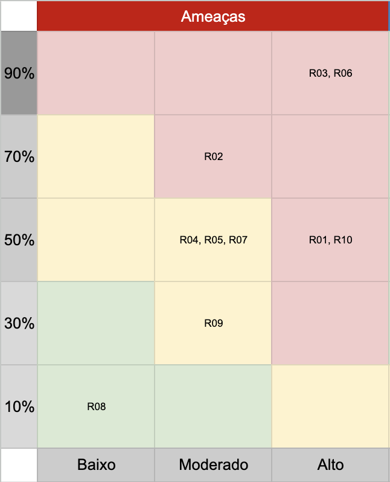
</div>

<h6 align="center"> Fonte: Elaborado pelo grupo Foster </h6>

### **Dividindo os Riscos em Clusters:**

1. **Gestão de Projeto:**
    - R01, R02, R03, R06, R10
2. **Competências e Conhecimento Técnico:**
    - R04, R05
3. **Foco e Direcionamento:**
    - R07, R08, R09

### **Estratégias e Responsáveis:**

- **R01 - Má gestão de tempo gerando atraso nas entregas:**
    - **Responsável:** PO (e time)
    - **Evitar:** Estabelecer prazos realistas e realizar uma análise cuidadosa do cronograma de entrega, mantendo uma comunicação direta entre o grupo, principalmente nas dailies.
    - **Reduzir/controlar:** Atualizar o Kanban sempre que necessário e monitorar regularmente o progresso das atividades.
- **R02 - Má comunicação do grupo gerando atraso nas entregas:**
    - **Responsável:** Scrum
    - **Evitar:** Promover uma cultura de comunicação aberta e incentivar a troca regular de informações entre os membros da equipe, principalmente nas dailies ou em algum momento de dificuldade.
    - **Reduzir/controlar:** Estabelecer uma comunicação ativa nos canais do grupo (slack e whatsapp) para alinhar expectativas e resolver as pendências.
- **R03 - Falta de membros por conta de doenças:**
    - **Responsável:** PO (e time)
    - **Reduzir/controlar:** Redistribuir as tarefas pendentes entre os membros do grupo presentes para cobrir ausências inesperadas.
- **R04 - Má utilização do GitHub:**
    - **Responsável:** Time (principalmente equipe dev da sprint)
    - **Evitar:** Todos os membros da equipe devem se familiarizar e estudar sobre o uso do GitHub.
    - **Reduzir/controlar:** Estabelecer boas práticas do grupo para o uso do GitHub, como padrão de branch, commit, etc. e oferecer suporte técnico entre os membros quando necessário.
- **R05 - Déficit técnico:**
    - **Responsável:** Time
    - **Evitar:** Realizar uma análise de lacunas de habilidades antes do início do projeto e distribuir as tarefas de modo a estimular o aprendizado sem pesar para quem tem dificuldade.
    - **Reduzir/controlar:** Oferecer auxílio e desenvolvimento contínuo de algumas tarefas para preencher lacunas de habilidades e promover a colaboração entre os membros da equipe.
- **R06 - Centralização de tarefas:**
    - **Responsável:** PO
    - **Evitar:** Promover uma cultura de delegação e empoderamento dentro da equipe.
    - **Reduzir/controlar:** Distribuir tarefas de forma equitativa e multifuncional entre os membros da equipe.
- **R07 - Afastamento do objetivo principal do projeto:**
    - **Responsável:** PO
    - **Evitar:** Definir claramente os objetivos do projeto desde o início e revisá-los regularmente durante todo o ciclo de vida do projeto.
    - **Reduzir/controlar:** Reavaliar as estratégias de desenvolvimento e manter a equipe focada nos objetivos principais.
- **R08 - Falta de foco durante as daily meetings:**
    - **Responsável:** Scrum
    - **Evitar:** Estabelecer tópicos claros para cada reunião e manter o foco nos principais itens de discussão.
    - **Reduzir/controlar:** Incentivar a participação ativa e comunicação direta de todos os membros da equipe.
- **R09 - Falta de profissionalismo durante as apresentações:**
    - **Responsável:** Scrum e PO (2 membros do grupo irão apresentar)
    - **Reduzir/controlar:** Realizar ensaios antes das apresentações com o grupo e o orientador e fornecer feedbacks construtivos para melhorar o desempenho.
- **R10 - Falta de discussão sobre assuntos cruciais do projeto:**
    - **Responsável:** PO (e time)
    - **Evitar:** Estabelecer uma cultura de transparência e incentivar a comunicação aberta entre todos os membros da equipe.
    - **Reduzir/controlar:** Agendar sempre que necessário reuniões para discutir questões cruciais do projeto, promovendo uma cultura de colaboração.

## Matriz de Oportunidades

&emsp;&emsp;Da mesma forma que a matriz de riscos é utilizada em nossos projetos, também implementamos a matriz de oportunidades. Esta matriz tem como função principal identificar e mapear possíveis oportunidades que podem surgir durante a execução do projeto. As oportunidades identificadas podem se traduzir em vantagens competitivas, melhorias no projeto, ou até mesmo a abertura de novos caminhos que podem ser explorados pela equipe. Portanto, a matriz de oportunidades desempenha um papel crucial em nosso processo de gerenciamento de projetos, permitindo-nos antecipar e aproveitar as oportunidades que surgem.

<h6 align="center"> Imagem 4: Matriz de Oportunidades </h6>

<div align="center">
	
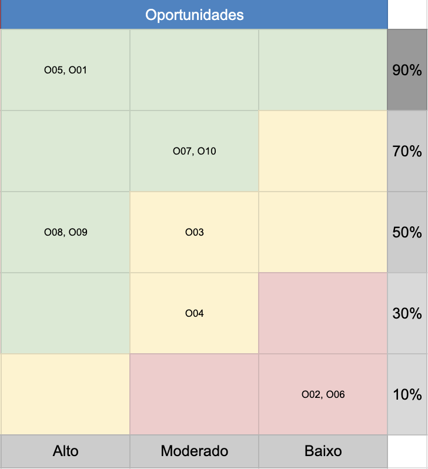
</div>

<h6 align="center"> Fonte: Elaborado pelo grupo Foster </h6>

### **Justificativas das Oportunidades:**

1. **O01 - Escalar o projeto mundialmente:** A Uber se mostrou uma empresa interessada em escalar seus projetos que dão certo, mundialmente. Dito isso, seria uma oportunidade única ver o nosso tendo esse nível de reconhecimento.
2. **O02 - Aumentar a complexidade da solução, deixando ela mais completa caso sobre tempo:** Caso o grupo consiga “terminar” o projeto antes do tempo previsto, seria uma oportunidade em tanto de aplicar mais ainda os conhecimentos adquiridos ao longo do módulo, aumentando a complexidade do projeto e, entregando mais valor ao cliente.
3. **O03 - Reconhecimento por parte da Uber:** Entregando um projeto que vá além das expectativas, o grupo pode até, quem sabe, receber um reconhecimento da Uber através de posts nas redes sociais da marca ou premiações.
4. **O04 - Possibilidade de contratação para estágios na Uber:** Fazer um projeto com uma empresa tão grande abre certas possibilidades para possíveis estágios.
5. **O05 - Visitar a Uber:** Já sabemos que vamos entregar o projeto para o cliente na própria Uber.
6. **O06 - Entender como funciona uma esteira de produção global:** Trabalhar com a Uber é uma oportunidade de entender como funciona trabalhar em um projeto com escala global, é uma oportunidade de extrair deles esse conhecimento e aprender sobre gestão de projetos.
7. **O07 - Formatar uma boa documentação para o projeto, mostrando a profissionalidade do grupo:** É uma oportunidade de mostrar o potencial do aluno Inteli ao mundo.
8. **O08 - Aprender a usar cada vez mais o kanban:** Compartilhar experiências de grupos anteriores e melhorar o uso da metodologia, isso pode garantir a entrega no tempo planejado.
9. **O09 - Aprender a valorizar o trabalho alheio:** Aprender a respeitar e valorizar o trabalho do outro, refletindo isso nas avaliações 360° e em futuras experiências de mercado.
10. **O10 - Apresentar em inglês:** Oportunidade de apresentar para membros da Uber que são estrangeiros e, de praticar o inglês através das apresentações.

&emsp;&emsp;Em conclusão, a matriz de riscos deste projeto indica que será um trabalho intensivo, porém com ótimas oportunidades e riscos de baixa probabilidade de ocorrência. Em outras palavras, tudo sugere que será um projeto intrigante e enriquecedor para os membros do grupo.

## <a name="c2.3"></a>2.3. Canvas Proposta de Valor

&emsp;&emsp;O Value Proposition Canvas é uma ferramenta estratégica para gerenciamento de negócios, projetada para ajudar empresas a desenvolver e refinar propostas de valor de forma eficaz. Dividido em Perfil do Cliente e Mapa de Valor, o modelo permite que as empresas entendam as necessidades, valores e tarefas de seus clientes. No Mapa de Valor, detalha-se como produtos ou serviços atendem essas necessidades, focando em aumentar benefícios, reduzir dificuldades e oferecer soluções diretas. O objetivo é compreender melhor os clientes para criar soluções mais eficazes, descobrir novas oportunidades de mercado e melhorar continuamente, incentivando inovação e satisfação do cliente.

<h6 align="center"> Imagem 5: Value Proposition Canvas </h6>

<div align="center">
	
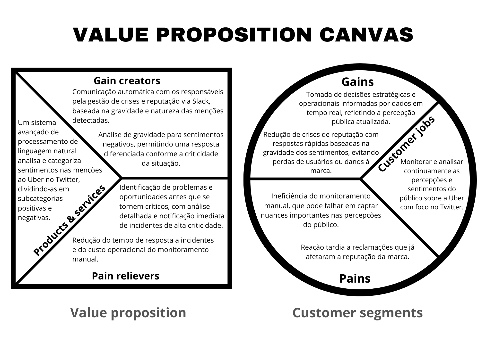
</div>

<h6 align="center"> Fonte: Elaborado pelo grupo Foster </h6>


&emsp;&emsp;O uso do Value Proposition Canvas neste contexto destaca-se como uma ferramenta crucial para aprimorar a estratégia de relacionamento e gestão de da marca Uber. Ao monitorar percepções e alinhá-las com soluções ágeis, como um sistema de análise de sentimentos baseado em processamento de linguagem natural, a empresa pode antecipar e mitigar problemas antes que eles escalonem. Implementar o Value Proposition Canvas permite não apenas otimizar as operações existentes, mas também inovar na forma como a Uber se engaja e satisfaz seus parceiros e usuários, garantindo uma abordagem mais robusta e orientada ao cliente no mercado competitivo de hoje. 

## <a name="c2.4"></a>2.4. Análise financeira do projeto

&emsp;&emsp;A "análise financeira [tem a finalidade de] concluir se uma
empresa tem ou não criado valor para os seus acionistas numa análise histórica, ou numa análise previsional (e.g., do plano estratégico) se é estimada a criação de valor. Deve, então, explicar as razões que levam, ou levaram naquela situação, à criação ou não criação de valor. Só dessa forma pode contribuir para as orientações estratégicas futuras da empresa." (NEVES, 2012).

&emsp;&emsp;Dito isso, para a presente análise financeira foi considerado os custos iniciais, de manutenção e a estimativa anual de custos do projeto. É importante ressaltar que não há a estimativa de receita, pois as entradas de caixa advindas dessa ferramenta são intangíveis ou não podem ser calculadas devido a falta de dados.

### Custos iniciais (Fase Acadêmica):

&emsp;&emsp;Os custos iniciais são referentes ao investimento necessário para produzir um MVP (Produto Mínimo Viável) e iniciar a criação e desenvolvimento do projeto. Nesse caso, se a Uber optasse por contratar profissionais externos para realizar o trabalho que está sendo feito pelo grupo, seria necessário 5 desenvolvedores juniores, um PO e um desenvolvedor sênior. 

<h6 align="center"> Tabela 9 </h6>

| Nome | Valor (R$) | Quantidade | Recorrência | Total (R$)  | Fonte |
|------|-------|-------------|------------|-------|------|
| Desenvolvedor Júnior | 3.250,00 | 5 | 3 meses | 48.750,00 | [Glassdoor](https://www.glassdoor.com.br/Sal%C3%A1rio/Uber-Desenvolvedor-J%C3%BAnior-Sal%C3%A1rios-E575263_D_KO5,25.htm) | 
| Project Manager | 17.000,00 | 1 | 3 meses | 51.000,00 | [Glassdoor](https://www.glassdoor.com.br/Sal%C3%A1rio/Uber-Project-Manager-Sal%C3%A1rios-E575263_D_KO5,20.htm) | 
| Senior Software Engineer | 37.000,00 | 1 | 3 meses | 111.000,00 | [Glassdoor](https://www.glassdoor.com.br/Sal%C3%A1rio/Uber-Senior-Software-Engineer-Sal%C3%A1rios-E575263_D_KO5,29.htm) |

&emsp;&emsp;Dado que o tempo estimado do desenvolvimento inicial é de 10 semanas, aproximadamente 3 meses, o valor total para iniciar o desenvolvimento seria de R$ 210.750,00.

### Custos de manutenção

&emsp;&emsp;Os custos de manutenção são necessários para que a solução continue a existir ao longo prazo. Ao longo dessa análise, foi considerado que seria necessário uma equipe responsável por aprimorar e manter o software (1 desenvolvedor Backend, 1 desenvolvedor frontend, 1 cientista de dados) e uma infraestrutura capaz de suportar todos os processos e se comunicaar com sistemas externos. Ademais, o tempo de recorrência considerado é de 9 meses, já que os 3 primeiros meses serão utilizados para realizar o desenvolvimento inicial.

<h6 align="center"> Tabela 10 </h6>

| Nome | Valor (R$) | Quantidade | Recorrência | Total (R$)  | Fonte |
|------|-------|-------------|------------|-------|------|
| Desenvolvedor backend | 14.000,00 | 1 | 9 meses | 126.000,00 | [Glassdoor](https://www.glassdoor.com.br/Sal%C3%A1rio/Uber-Backend-Engineer-Sal%C3%A1rios-E575263_D_KO5,21.htm)|
| Desenvolvedor frontend | 13.000,00 | 1 | 9 meses | 117.000,00 | [Glassdoor](https://www.glassdoor.com.br/Sal%C3%A1rio/Uber-Frontend-Engineer-Sal%C3%A1rios-E575263_D_KO5,22.htm) |
|Cientista de dados | 23.200,00 | 1 | 9 meses | 208.500,00 | [Glassdoor](https://www.glassdoor.com.br/Sal%C3%A1rio/Uber-Data-Scientist-Sal%C3%A1rios-E575263_D_KO5,19.htm) |
| Amazon EC2 | 7.470,82 | 100 | 9 meses | 67.237,38 | [Amazon AWS](https://calculator.aws/#/createCalculator/ec2-enhancement?refid=ap_card)|
|API de dados do X (antigo Twitter) | 214.914,00 | 1 | 9 meses | 1.934.226,00 | [Tecnoblog](https://tecnoblog.net/noticias/twitter-anuncia-novos-planos-de-suas-apis-contas-tem-30-dias-para-se-adaptar/) |

&emsp;&emsp;Dado isso, o custo total para manter o projeto é no valor de R$ 2.452.963,38.


###  Impactos Esperados

&emsp;&emsp;O "Emotion" permitirá à Uber monitorar sentimentos dos usuários em tempo real, identificando tendências e reagindo proativamente. Esta ferramenta ajudará a evitar crises de imagem e a melhorar a qualidade do serviço ao responder rapidamente às mudanças na percepção dos clientes. A visão estratégica proporcionada pode ser crucial para decisões de negócios e inovações de serviço.

### Conclusão

&emsp;&emsp;A implementação do "Emotion" é um investimento estratégico significativo para a Uber. Embora os custos iniciais sejam contidos aos salários dos desenvolvedores, os investimentos pós-entrega em infraestrutura e dados são justificados pelo potencial da ferramenta de proporcionar insights valiosos e melhorar a interação com os usuários. A Uber deve considerar esses custos como um investimento na melhoria contínua da experiência do cliente e na manutenção de sua reputação no mercado competitivo. Por fim, o custo total da implementação do projeto durante seu primeiro ano seria de R$ 2.663.713,38.

# <a name="c3"></a>3. Entendimento do Usuário
## <a name="c3.1"></a>3.1. Personas

&emsp;&emsp;As personas são representações semi fictícias dos usuários reais que ajudam a alinhar as necessidades, objetivos e comportamentos dos clientes, produtos ou serviços desenvolvidos. De forma mais profunda, é possível afirmar que a persona é desenvolvida para refinar a comunicação com os usuários e a entender o posicionamento do produto no mercado. Portanto, elas desenvolvem um papel crucial na solução final, permitindo uma visualização mais ampla e clara do público-alvo, suas características demográficas, preferências e desafios, colaborando com um projeto mais eficiente que forneça a melhor experiência para o usuário.

<h6 align="center"> Imagem 6: Persona Mariana</h6>

<div align="center">
	

</div>

<h6 align="center"> Fonte: Elaborado pelo grupo Foster </h6>

<h6 align="center"> Imagem 7: Persona Sarah</h6>

<div align="center">
	

</div>

<h6 align="center"> Fonte: Elaborado pelo grupo Foster </h6>

&emsp;&emsp;A análise das personas Mariana e Sarah destaca a necessidade de melhorar a interação com dados desorganizados nas redes sociais. Ambas enfrentam desafios ao lidar com grandes volumes de informações e buscam soluções que permitam respostas rápidas e precisas. Para isso, é fundamental implementar tecnologias de processamento de linguagem natural. Essas ferramentas ajudarão a categorizar os dados, facilitando o trabalho das analistas e permitindo uma resposta mais eficiente às necessidades dos usuários. Além de melhorar a eficiência, essas tecnologias também podem personalizar a interação com os clientes, otimizando as estratégias da Uber.

## <a name="c3.2"></a>3.2. Mapa de Empatia

&emsp;&emsp;O mapa de empatia é uma ferramenta que auxilia no entendimento das necessidades e comportamentos das personas, permitindo um conhecimento maior nas perspectivas e emoções dos clientes. Utilizado principalmente no desenvolvimento de produtos, serviços e estratégias de marketing, o mapa é dividido em seções que exploram o que os usuários dizem, pensam, fazem e sentem, revelando insights para a criação de soluções mais alinhadas e empáticas.

<h6 align="center"> Imagem 8: Mapa de Empatia Mariana</h6>

<div align="center">
	
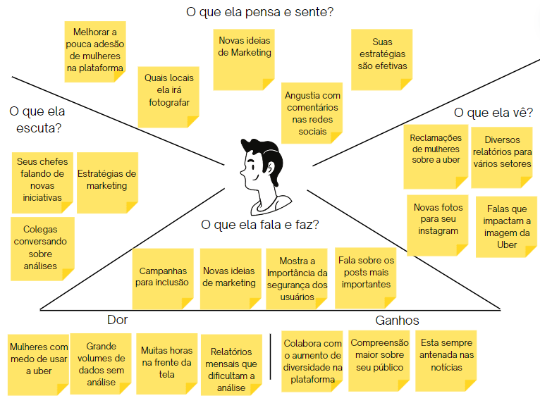
</div>
<h6 align="center"> Fonte: Elaborado pelo grupo Foster </h6>

<h6 align="center"> Imagem 9: Mapa de Empatia Sarah</h6>

<div align="center">
	
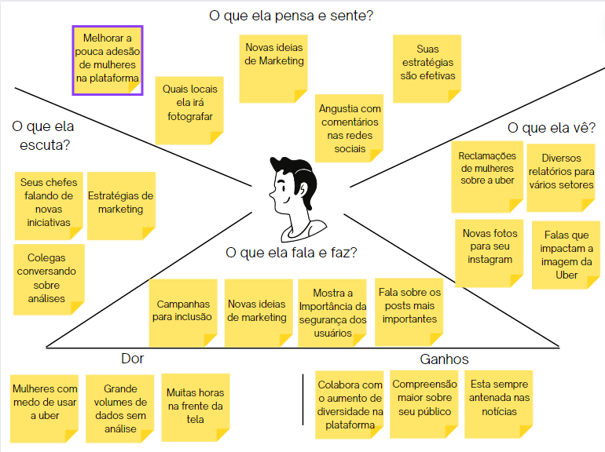
</div>
<h6 align="center"> Fonte: Elaborado pelo grupo Foster </h6>

&emsp;&emsp;Através dos mapas de empatia, conclui-se que as profissionais envolvidas dedicam um tempo significativo nas telas, absorvendo uma variedade de informações relacionadas à Uber, tanto positivas quanto negativas, observa-se uma rotina intensa de monitoramento e interação com dados, clientes e colegas, o que destaca a relevância de suas funções na percepção da marca. Contudo, esse envolvimento constante pode ser desgastante, conforme indicado pelas áreas de "dor" nos mapas, a análise mensal dos relatórios parece ser um ponto crítico que merece atenção, pois dificulta as análises dos profissionais, já que as respostas da empresa sobre ataques demoram mais do que deviam.  Pode-se concluir que para tornar a resposta sobre o que os usuários sentem mais eficaz, poderíamos usar formatos simples e diretos na mensagem do slack, como os posts em redes sociais, tornando-a mais fácil de entender e mais próxima do que as profissionais já estão acostumadas a ver no dia a dia.


## <a name="c3.3"></a>3.3. User Stories
&emsp;&emsp;User Stories, segundo a Agile Alliance, é uma forma de dividir as tarefas em funcionalidades a serem implementadas, tendo que por definição agregar valor ao produto uma vez que estão implementadas. Alguns dos benefícios da utilização de user stories são principalmente a mitigação de riscos ao longo do projeto e a clareza dos critérios de aceitação.<p>

&emsp;&emsp;A seguir está documentado em tabelas as user stories utilizadas para guiar o projeto ao longo das sprints. É importante considerar que mudanças podem ocorrer devido a necessidades do parceiro e possíveis aperfeiçoamentos nos requisitos solicitados.<p>

<h6 align="center"> Tabela 11 </h6> 

| Número | 1.0 |
| ------ | ---------- |
| **Título** |  Receber a notificação no slack e estar disponível um exemplo com o conteúdo do comentário|
| **Persona** | Mariana Rocha, Analista de Mídias Sociais |
| **História** | Eu, no papel de **Mariana Rocha**, quero **receber notificações no Slack sobre os comentários dos usuários**, sendo possível **acessar um comentário de exemplo** na mensagem. |
| **Critérios de aceitação** | **CR-01 -** Apresentar na mensagem um link ou imagem contendo um exemplo de comentário dos usuários.<br> **Validação:** Possui acesso ao link ou imagem|
| **Testes de aceitação** | Critério de aceitação: **CR-01** <br> a. A mensagem possuim link de acesso<br> - Funcionou = Correto.<br> - Não funcionou = Errado, deve ser corrigido.<br><br>b. A mensagem possui imagem de exemplo<br> - Legível = Correto.<br> - Não legível = Errado, deve ser corrigido.<br><br>c. A mensagem não possui imagem de exemplo ou link <br> - Enviado = Errado, deve ser corrigido.<br> - Não enviado = Correto.|

<br>
<h6 align="center"> Tabela 12 </h6> 

| Número | 2.0 |
| ------ | ---------- |
| **Título** |  Receber a notificação no slack e estar claro que as informações tem alto impacto positivo |
| **Persona** | Mariana Rocha, Analista de Mídias Sociais |
| **História** | Eu, no papel de **Mariana Rocha**, quero **receber notificações sobre as mensagens dos usuários**, sendo possível **identificar que o comentário tem alto impacto positivo** na mensagem. |
| **Critérios de aceitação** | **CR-01 -** Apresentar na mensagem de maneira clara dados, através da análise de sentimento, que representam o alto impacto positivo para a marca. <br> **Validação:** A mensagem apresenta os dados da analise de sentimento extremamente positiva.|
| **Testes de aceitação** | Critério de aceitação **CR-01** <br> a. A mensagem do usuário conta uma história impressionante envolvendo a Uber<br> - Notificou = Correto. <br> - Não notificou = Errado, deve ser corrigido.<br><br> b. A mensagem do usuário elogia a Uber em uma discussão<br> - Notificou = Errado, deve ser corrigido<br> - Não Notificou = Correto|

<br>
<h6 align="center"> Tabela 13 </h6> 

| Número | 3.0 |
| ------ | ---------- |
| **Título** |  Receber a notificação no slack e estar claro que as informações tem alto impacto negativo |
| **Persona** | Mariana Rocha, Analista de Mídias Sociais |
| **História** | Eu, no papel de **Mariana Rocha**, quero **receber notificações sobre as mensagens dos usuários**, sendo possível **identificar que o comentário tem alto impacto negativo** na mensagem. |
| **Critérios de aceitação** | **CR-01 -** Apresentar na mensagem de maneira clara dados, através da análise de sentimento, que representam o alto impacto negativo para a marca. <br> **Validação:** A mensagem apresenta os dados da analise de sentimento extremamente negativa ou com temas críticos, como por exemplo casos de racismo, assédio, estupro, aliciamento de menores e etc.|
| **Testes de aceitação** | Critério de aceitação **CR-01** <br> a. A mensagem do usuário denuncia um caso horrível envolvendo a Uber<br> - Notificou = Correto. <br> - Não notificou = Errado, deve ser corrigido.<br><br> b. A mensagem do usuário fala mal da Uber em uma discussão<br> - Notificou = Errado, deve ser corrigido<br> - Não Notificou = Correto<br><br> c. A mensagem do usuário possui um dos temas críticos destacados<br> - Notificou = Correto<br> - Não Notificou = Errado, deve ser corrigido|
<br>
<h6 align="center"> Tabela 14 </h6> 

| **Número** | 4.0 |
| --- | --- |
| **Título** | Capacidade de verificar data da informação |
| **Personas** | Sarah Thompson, Certificada em Digital Marketing |
| **História** | Eu, no papel de **Sarah Thompson**, quero **ter a capacidade de verificar as datas dos comentários**, sendo possível **acessar essa informação através da mensagem**. |
| **Critérios de aceitação** | **CR-01 -** O modelo deve permitir a análise da data de um certo tweet.<br>**Validação:** A mensagem disponibiliza o acesso da data dos comentários.<br><br>**CR-02 -** O robô do Slack deve criar o aviso já com a data do tweet critico em questão.<br>**Validação:** A mensagem disponibiliza o acesso da data dos comentários críticos em evidência |
| **Testes de aceitação** | Critério de aceitação: **CR-01**<br>a. A Mariana tenta acessar a data de um certo tweet no banco de dados<br>- Aceitou = Correto<br>- Recusou = Errado, deve ser corrigido<br><br>Critério de aceitação: **CR-02**<br>a. Os avisos do robô do Slack não possuem data e nem horário<br>- Verdadeiro = Errado, deve ser corrijido<br>- Falso = Correto |
<br>

<h6 align="center"> Tabela 15 </h6> 

| **Número** | 5.0 |
| --- | --- |
| **Título** | Capacidade de verificar a classificação de intensidade dos usuários |
| **Personas** | Sarah Thompson, Certificada em Digital Marketing |
| **História** | Eu, no papel de **Sarah Thompson**, quero **ter a capacidade de verificar a classificação de intensidade dos sentimentos dos usuários**, sendo possível **acessar essa informação através da mensagem**. |
| **Critérios de aceitação** | **CR-01 -** O robô do slack deve ter um termômetro de humor para facilitar a identificação de momentos críticos, sem ser exatamente um acontecimento pontual grave.<br>**Validação:** Possui visualização do sentimento geral dos usuários.<br><br>**CR-02 -** O robô do Slack deve criar o aviso apenas em casos extremos.<br>**Validação:** Em casos extremos o aviso é criado.|
| **Testes de aceitação** | Critério de aceitação: **CR-01**<br>a. O robô do Slack não permite a visualização da situação atual dos tweets.<br>- Aceitou = errado, deve ser corrigido<br>- Recusou = correto<br><br>b. O robô do Slack permite a visualização da situação atual dos tweets através de uma régua de humor<br>- Aceitou = correto<br>- Recusou = errado, deve ser corrigido<br><br>Critério de aceitação: **CR-02**<br>a. O robô do Slack cria avisos sobre todos os comentários considerados ruins pelo modelo;<br>- Aceitou = errado, deve ser corrigido<br>- Recusou = correto.<br><br>b. O robô do Slack cria avisos somente sobre os comentários considerados críticos pelo modelo, por exemplo, comentários sobre casos de racismo, assédio, estupro, aliciamento de menores e etc.<br>- Aceitou = correto<br>- Recusou = errado, deve ser corrigido.|
|||

<br>
&emsp;&emsp;Considerando as tabelas apresentadas e as considerações feitas na introdução dessa sessão, as informações documentadas fornecem uma base sólida para os requisitos funcionais do projeto. É essencial destacar que as user stories são ferramentas valiosas na metodologia ágil, pois não só dividem tarefas em funcionalidades implementáveis, mas também garantem que cada entrega agregue valor ao produto.<p>

# <a name="c4"></a>4. Análise descritiva

&emsp;&emsp;A análise descritiva é uma ferramenta estatística fundamental que facilita a compreensão dos dados através da elaboração de métricas e gráficos. Esta etapa é especialmente crucial no início de um projeto, destacando-se em contextos como o de modelos de processamento de linguagem natural (PLN), onde se trabalha com bases de dados contendo informações abstratas sujeitas a múltiplas interpretações. Esta análise inicial ajuda a esclarecer padrões e tendências, orientando as decisões subsequentes e a interpretação de resultados mais complexos.

## <a name="c4.1"></a>4.1. Gráficos

&emsp;&emsp;Os gráficos do nosso projeto foram realizados no juptyter notebook e serviram para uma maior compreensão da nossa base de dados. Abaixo temos suas descrições e ao final as conclusões feitas a partir dessa análise.

<h6 align="center"> Imagem 10: Gráfico 1 </h6>

<div align="center">
	
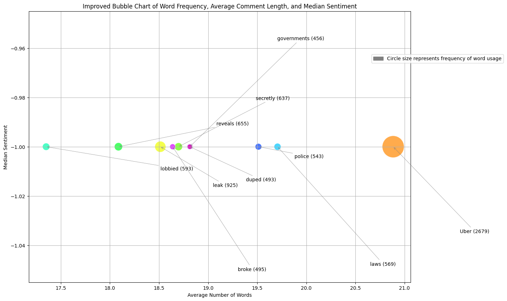
</div>

<h6 align="center"> Fonte: Elaborado pelo grupo Foster </h6>

&emsp;&emsp;O gráfico "Improved Bubble Chart of Word Frequency, Average Comment Length, and Median Sentiment" utiliza a frequência de palavras, o comprimento médio dos comentários e o sentimento mediano para ilustrar como diferentes termos são utilizados nos comentários. Nele, termos como "Uber" destacam-se pela alta frequência e por aparecerem em comentários mais longos, sugerindo uma relevância ou interesse significativo. Palavras como "lobbied" e "leak" apresentam sentimentos predominantemente negativos, refletindo possíveis contextos críticos ou problemáticos. Este gráfico oferece uma visão clara de quais temas são mais discutidos ou controversos, ajudando na identificação de padrões importantes nos dados.

<h6 align="center"> Imagem 11: Gráfico 2 </h6>

<div align="center">
	
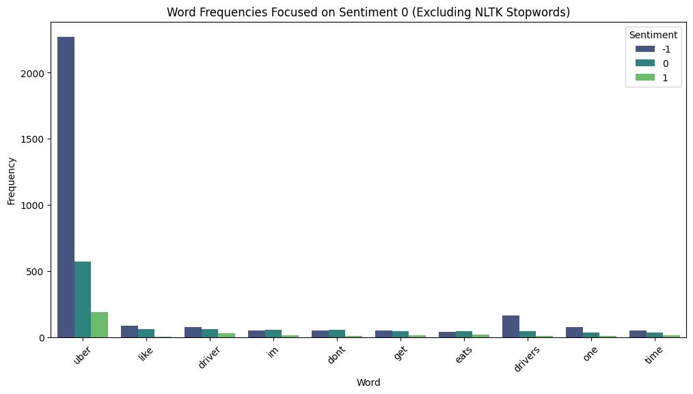
</div>
<h6 align="center"> Fonte: Elaborado pelo grupo Foster </h6>


&emsp;&emsp;Esse gráfico mostra as palavras mais frequentes, classificadas pelo sentimento 0 (o neutro), depois da remoção das stop words (stop words é uma etapa do pré-processamento, esse processo está descrito no tópico "Pré-processamento" da nossa documentação) em comparação aos outros sentimentos, o que traz uma visualização de quais palavras podem ser relacionadas a esse sentimento

<h6 align="center"> Imagem 12: Gráfico 3 </h6>

<div align="center">
	
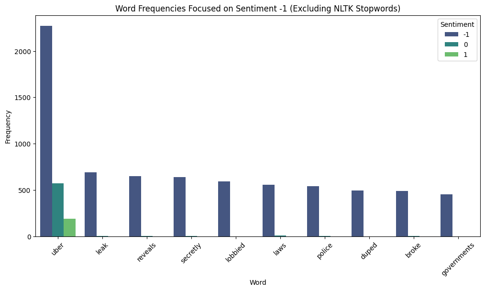
</div>
<h6 align="center"> Fonte: Elaborado pelo grupo Foster </h6>

&emsp;&emsp;Esse gráfico tem a mesma ideia do gráfico 2, porém está sendo aplicado com o sentimento -1 (o negativo), mostrando que as palavras ”uber”, “leaks” e “reveals” são as que mais aparecem quando se trata de uma frase negativa.

<h6 align="center"> Imagem 13: Gráfico 4 </h6>

<div align="center">
	
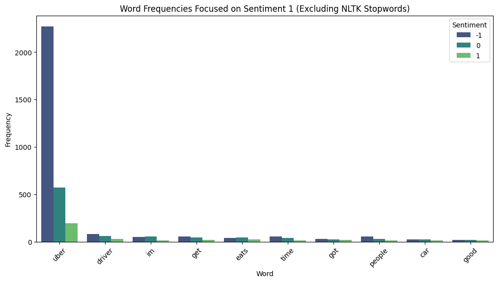
</div>
<h6 align="center"> Fonte: Elaborado pelo grupo Foster </h6>

&emsp;&emsp;Esse gráfico segue mostrando as maiores frequências, porém agora em relação ao sentimento 1 (o positivo), nele é possível ver que as palavras com a maior aparição são as "uber", "im" e “driver”.

## <a name="c4.2"></a>4.2. Conclusões

&emsp;&emsp;A partir das análises feitas dos gráficos 1, 2, 3 e 4, é possível obter ideias importantes para o aprimoramento do modelo. Os gráficos demonstram como diferentes palavras são distribuídas em relação aos sentimentos negativos, neutros e positivos, após a remoção de stopwords. Esta análise de frequência de palavras ajuda a entender quais termos são mais impactantes ou indicativos de sentimentos específicos nos comentários dos usuários.

1. **Frequência de Palavras e Sentimento Neutro (Gráfico 1)**: Observa-se que palavras mais neutras como "have", "not", e "but" predominam. Isso sugere que declarações mais equilibradas ou condicionais estão frequentemente associadas a sentimentos neutros. Incorporar a frequência e o contexto de uso destas palavras pode ajudar o modelo a identificar melhor os comentários que são verdadeiramente neutros.

2. **Frequência de Palavras e Sentimento Negativo (Gráfico 2)**: Palavras como”uber”, "leak" e "reveals" são frequentes em contextos negativos, o que pode indicar problemas ou insatisfações expressas pelos usuários. O modelo pode ser ajustado para ser mais sensível a esses termos, especialmente em contextos onde a conotação negativa é clara, melhorando a precisão na identificação de feedback negativo.

3. **Frequência de Palavras e Sentimento Positivo (Gráfico 3)**: Palavras como "my" e "on" aparecem frequentemente em comentários positivos. Apesar de serem palavras comuns, seu uso em contextos positivos pode ser um indicativo de experiências pessoais positivas ou aprovações. Treinar o modelo para reconhecer essas nuances pode enriquecer a análise de sentimentos positivos.

4. **Bubble Chart de Frequência de Palavras, Comentário Médio e Sentimento (Gráfico 1)**: O termo "Uber" destaca-se significativamente não só pela frequência mas também pelo tamanho dos comentários, indicando uma discussão detalhada ou significativa em torno da marca. 

&emsp;&emsp;Assim, podendo concluir que seria prudente considerar ajustes nos pesos atribuídos a certas palavras dentro dos algoritmos de análise de sentimentos, baseando-se na frequência e no contexto revelado pelos gráficos. Além disso, a integração de análises de tamanho de comentários e sua correlação com o sentimento pode oferecer uma nova interpretação dos dados, já que ao analisar o conjunto dos gráficos é possível afirmar que as maiores frases tendem a ser de sentimento negativo.

# <a name="c5"></a>5. Pré-processamento

&emsp;&emsp;"O pré-processamento de dados consiste em um processo de preparação, manipulação e transformação de um conjunto de dados brutos a fim de que o conhecimento possa ser corretamente obtido por algoritmos e técnicas de mineração de dados (PYLE, 1999 apud MARIANO, 2021)." (MARIANO, 2021). Logo, é necessário realizar essa etapa para que seja possível aplicar os modelos de vetorização e preescrição, tais como _K-Means_ e Naive Bayes.

&emsp;&emsp;Ademais, o pré-processamento para o Processamento de Linguagem Natural (PLN) é composto por: 
<ol>
<li>Tokenização</li> 
<li>Tags POS (<i>Part Of Speech</i>)</li>
<li>Remoção das <i>Stop Words</i></li>
<li>Lemmatização</li>
</ol>

## <a name="c5.1"></a>5.1. Tokenização

&emsp;&emsp;"Tokenização é o processo de dividir uma frase em palavras ou tokens individuais. Durante esse processo, pontuações e caracteres especiais são completamente removidos. É importante ressaltar que os tokens não são necessariamente apenas uma palavra. Quando temos palavras compostas, elas podem ter significados totalmente diferentes, como: “beija-flor” e “segunda-feira”. De uma forma geral, tokenização é o ato de simplificar o corpus [texto] e prepará-lo para os outros estágios de processamento." (Alura, 2024).

&emsp;&emsp;Vale ressaltar que a tokenização é feita para facilitar os outros processos e a leitura por parte do modelo. A partir disso, a tokenização dos textos foi realizada utilizando a biblioteca _Spacy_ do Python, a qual separa palavras e pontuações. Por exemplo, a palavra-composta "beija-flor" seria dividida em "beija", "-" e "flor". Além disso, essa biblioteca já integra outras funcionalidades que auxiliam o pré-processamento e serão abordadas posteriormente.

## <a name="c5.2"></a>5.2. Tags POS (_Part Of Speech_)

&emsp;&emsp;Na rotulação de parte da fala, "[...] tem-se a divisão de um texto em frases ou em palavras, por exemplo, ou mesmo a divisão de palavras que formam esse texto nos denominados morfemas, unidades significativas dentro da palavra" (Martins, 2020). 

&emsp;&emsp;Fazendo um breve resumo, Part-of-speech é a função que uma palavra desempenha em uma sentença, como substantivo, verbo, adjetivo, etc. No contexto do projeto, a biblioteca _spacy_ contém nativamente a rotulação das palavras. Tal atividade é relevante para a remoção das <i>stop words</i> dos textos, a qual será abordada a seguir.

## <a name="c5.3"></a>5.3. Remoção das _Stop Words_

&emsp;&emsp;"É a técnica que faz a remoção de ruídos do texto que são menos evidentes que pontuações, como os conectivos “que”, “o”, “a”, “de”, entre outros. Quase todos os textos em português contém conectivos e palavras comuns que não são significativas [não agregam intensidade e emoção] para o nosso modelo, então podemos retirá-las." (Alura, 2024).

&emsp;&emsp;Para o projeto, manteve apenas substantivos, verbos, adjetivos e advérbios. Desse modo, é possível analisar apenas palavras que agregam valor a mensagem e economizar tempo de processamento e complexidade dos dados.

## <a name="c5.4"></a>5.4. Lemmatização

&emsp;&emsp;"Na lemmatization também vamos buscar reduzir a palavra à sua raiz, retirando todas as inflexões e chegando ao lemma. Porém, essa redução sempre resultará em uma palavra que realmente existe na gramática. Outro ponto importante é que, nessa técnica, a classe gramatical da palavra será levada em consideração para fazer a redução." (ALURA, 2021). 

&emsp;&emsp;A partir disso, foi utilizado a biblioteca _spacy_ com base no seu banco de dados nomeado pt_core_news_lg para obter a raiz das palavras.

## <a name="c5.5"></a>5.5. Pipeline

&emsp;&emsp;Portanto, para que cada um desses processos possam ser reutilizados em outras bases de treino foi criado uma sequência automatizada desses processos: o _pipeline_. Essa ferramenta é útil para possibilitar que novos textos sejam analisados pelo modelo sem a necessidade da intervenção humana. Sua sequência está descrita na imagem a seguir: 
<h6 align="center"> Imagem 14: Passos Pré-processamento </h6>

<div align="center">

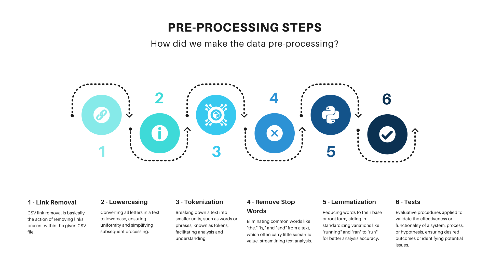
	
</div>

<h6 align="center"> Fonte: Elaborado pelos autores </h6>

<h6 align="center"> Fonte: Elaborado pelo grupo Foster </h6>

# <a name="c6"></a>6. Modelo de Bag of Words (IPYNB)


&emsp;&emsp;Uma das técnicas elementares, mas ainda muito popular na PLN e na mineração de texto, é o Bag of Words (BoW). Ele cria uma representação de modelo que transforma palavras em números para fornecer uma maneira conveniente para o computador entender o que lê. O princípio BoW baseia-se na ideia de que a ordem não importa nos dados de texto; apenas a frequência importa, pois carrega significado<p>

&emsp;&emsp;Poucas etapas são executadas durante a criação do conjunto de palavras. Os dados de texto são primeiro pré-processados: isso envolve tokenização, remoção de palavras irrelevantes e stemming ou lematização. A tokenização divide o texto em palavras individuais ou tokens, enquanto palavras irrelevantes – palavras comuns em inglês como “the” e “is” – são eliminadas porque não agregam valor ao significado. A lematização ou stemming normaliza os dados, reduzindo as palavras às suas raízes, como por exemplo “disorganized” em “disorganize”, até mesmo em “organize”, dependendo do detalhamento da função.<p>
	
&emsp;&emsp;Depois de passar pelo pré-processamento, um vocabulário pode ser estabelecido. Ele lista todas as palavras exclusivas encontradas no corpo do texto. Esse vocabulário então desempenha um papel fundamental na construção de uma matriz. Aqui, cada linha simboliza um documento, enquanto cada coluna simboliza uma palavra da lista de vocabulário. A própria matriz é preenchida com frequências – a frequência com que cada palavra aparece em cada documento, levando a uma representação esparsa dos dados do texto original. Para exemplificar melhor, as frases: “O gato é branco e feliz” e “O cachorro é marrom e feliz”, após passarem por essas etapas, seria criado o seguinte vocabulário: [“gato”, “branco”, “feliz”, “cachorro”, “marrom”]. Nessa estrutura, para a máquina, a visualização ficaria para a primeira frase: [1, 1, 1, 0, 0] e [0, 0, 1, 1, 1] para a segunda, tornando as frases legíveis computacionalmente.<p>

&emsp;&emsp;O modelo BoW visa principalmente transmutar matéria textual bruta em forma numérica: um ato facilmente consumível por mecanismos de aprendizado de máquina. O resultado final? Com esta representação numérica em mãos, pode-se apresentar metodologias estatísticas e matemáticas para decifrar o que estes dados transmitem; entender como ele pode ser categorizado ou até mesmo desvendar em qual categoria ele melhor se enquadra.<p>

&emsp;&emsp;O modelo tem a simplicidade como uma de suas principais vantagens, mas também é eficiente: essa técnica é fácil de ser implementada e pode lidar com grandes quantidades de dados de texto. Contudo, uma desvantagem significativa desta abordagem é que ela não se concentra na identificação do contexto. Em vez disso, dá mais peso à frequência das palavras, o que por sua vez pode resultar na perda de contexto de um documento e na supervalorização de palavras que aparecem com muita frequência.<p>

&emsp;&emsp;No entanto, apesar de suas limitações, o BoW encontra ampla aplicação em empreendimentos de PLN, incluindo análise de sentimento, bem como categorização e recuperação de texto. Na verdade, constitui uma técnica básica no processamento de texto – mesmo com as suas limitações – porque estabelece uma base sólida para outros modelos sofisticados, juntamente com métodos de processamento de linguagem natural.<p>

&emsp;&emsp;Na nossa implementação do BoW, testamos o CountVectorizer() e o TfidfVectorizer() do scikit-learn para converter texto em uma representação numérica. O CountVectorizer() cria uma matriz de contagem de ocorrências de palavras em cada documento, enquanto o TfidfVectorizer() leva em consideração a frequência da palavra no documento e a frequência inversa do documento em toda a coleção de documentos –  isso resulta em uma representação numérica onde as palavras raras recebem mais peso.<p>

## <a name="c6.1"></a>6.1. Métodos

### <a name="c6.1.1"></a>6.1.1. CountVectorizer (scikit-learn)

&emsp;&emsp;Essa parte da documentação apresenta o CountVectorizer, uma ferramenta essencial da biblioteca scikit-learn para pré-processamento e vetorização de texto, que desempenha um papel crucial na análise de dados. Esta seção visa fornecer uma visão abrangente das funcionalidades e usos do CountVectorizer, destacando sua importância e flexibilidade em diversas aplicações.
<br>

**CountVectorizer: Uma Visão Geral**

&emsp;&emsp;O CountVectorizer é uma ferramenta poderosa para transformar texto em uma representação numérica adequada para análise de dados. Com uma variedade de funcionalidades, que incluem desde a remoção de stopwords até a criação de n-gramas, oferece um controle refinado sobre o processo de vetorização do texto. Sua capacidade de personalização permite que os usuários modelem a representação do texto de acordo com as necessidades específicas de seus projetos.
<br>

**Usos e Personalização**

&emsp;&emsp;Uma das principais vantagens do CountVectorizer é sua capacidade de personalização na vetorização do texto. Os usuários podem escolher entre diferentes opções de modelagem, como a contagem de palavras individuais ou a inclusão de pares/trios de palavras. Essa flexibilidade é fundamental para adaptar a representação do texto às particularidades de cada projeto, garantindo que o modelo capture com precisão as informações relevantes.
<br>

**Aplicação no Projeto**

&emsp;&emsp;No contexto deste projeto, o CountVectorizer foi utilizado como um dos modelos do Bag of Words (BoW) para testes. Embora seja capaz de realizar várias etapas de pré-processamento, neste projeto, optamos por empregá-lo exclusivamente como vetorizador. O pré-processamento e a criação do BoW foram realizados simultaneamente, utilizando apenas as funcionalidades disponíveis no CountVectorizer. Essa abordagem permitiu uma avaliação comparativa da eficácia do pré-processamento separado em comparação com a abordagem combinada, fornecendo insights valiosos sobre a melhor maneira de preparar os dados para análise.


&emsp;&emsp;Em resumo, o CountVectorizer é uma ferramenta versátil e poderosa para pré-processamento e vetorização de texto. Sua capacidade de personalização, juntamente com suas diversas funcionalidades, o torna uma escolha ideal para uma variedade de aplicações de análise de dados. No contexto deste projeto, sua aplicação como um dos modelos do BoW demonstrou sua eficácia e adaptabilidade, fornecendo insights valiosos para a preparação de dados para análise.
<br>

### <a name="c6.1.2"></a>6.1.2. TfidVectorizer (scikit-learn)

&emsp;&emsp;Essa segunda seção apresenta o TfidfVectorizer, outra ferramenta importante da biblioteca scikit-learn para pré-processamento e vetorização de texto, desempenhando um papel essencial na análise de dados. O TfidfVectorizer oferece uma abordagem diferente em relação ao CountVectorizer, calculando os pesos das palavras com base na frequência do termo (TF) e na frequência do inverso do documento (IDF), o que o torna especialmente útil para a representação de texto em tarefas de classificação e mineração de texto.
<br>

**TfidfVectorizer: Uma Visão Geral**

&emsp;&emsp;O TfidfVectorizer é uma ferramenta para transformar texto em uma representação numérica mais sofisticada do que o CountVectorizer. Ele utiliza uma combinação de TF (Frequência do Termo) e IDF (Frequência do Inverso do Documento) para atribuir pesos às palavras, dando mais importância aos termos que aparecem frequentemente em um documento específico, mas raramente em outros documentos da coletânea.
<br>

**Usos e Personalização**

&emsp;&emsp;Assim como o CountVectorizer, o TfidfVectorizer oferece flexibilidade em termos de personalização. Os usuários podem ajustar parâmetros como o uso de stopwords, a criação de n-gramas e a ponderação dos termos, para adaptar a representação do texto de acordo com as necessidades específicas de cada projeto. Essa capacidade de personalização permite uma modelagem mais precisa e eficaz da informação textual.
<br>

**Aplicação no Projeto**

&emsp;&emsp;No contexto desse projeto, o TfidfVectorizer foi utilizado como uma das técnicas de vetorização de texto para análise. Diferentemente do CountVectorizer, o TfidfVectorizer calcula os pesos dos termos com base em uma medida combinada de frequência do termo e frequência do inverso do documento. Essa abordagem foi essencial para capturar a importância relativa dos termos em cada documento, fornecendo uma representação mais refinada e informativa dos dados textuais.
<br>

**Conclusão**

&emsp;&emsp;Em resumo, o TfidfVectorizer é uma ferramenta valiosa para pré-processamento e vetorização de texto, especialmente em tarefas de classificação e mineração de texto. Sua abordagem baseada em TF-IDF oferece uma maneira eficaz de representar a importância relativa dos termos em um corpus de documentos. No contexto do projeto analisado, sua aplicação como uma das técnicas de vetorização de texto demonstrou sua eficácia na captura da relevância dos termos, contribuindo para uma análise mais precisa e significativa dos dados textuais.
<br>


## <a name="c6.2"></a>6.2. Naive Bayes

&emsp;&emsp;O Naive Bayes é um algoritmo de classificação probabilística baseado no teorema de Bayes, que assume independência entre as características (por isso "Naive" no nome). Apesar dessa suposição simplificada, o Naive Bayes é surpreendentemente eficaz em muitos cenários práticos.<p>

### Funcionamento

&emsp;&emsp;**Treinamento:** Primeiro, calculamos as probabilidades de cada classe e as condicionais de cada característica para cada classe, a partir dos dados de treinamento.<p>

&emsp;&emsp;**Classificação:** Dado um novo ponto de dado, calculamos a probabilidade de pertencer a cada classe utilizando o teorema de Bayes, que relaciona a probabilidade de uma classe dada as características observadas com as probabilidades condicionais e marginais.<p>

&emsp;&emsp;**Classificação final:** O ponto de dado é então atribuído à classe com a maior probabilidade calculada.<p>

### Vantagens e Desvantagens

#### Vantagens:

&emsp;&emsp;**Simplicidade:** Fácil de implementar e compreender.<p>
&emsp;&emsp;**Eficiência:** Rápido e escalável, especialmente para grandes conjuntos de dados.<p>
&emsp;&emsp;**Robusto para dados ruidosos:** Lida bem com características categóricas e é resistente a dados ruidosos.<p>

#### Desvantagens:

&emsp;&emsp;**Suposição de independência:** Nem sempre verdadeira, o que pode levar a uma performance subótima em alguns conjuntos de dados.<p>
&emsp;&emsp;**Não adequado para problemas complexos:** Pode não lidar bem com relacionamentos complexos entre características.<p>

&emsp;&emsp;O Naive Bayes é uma boa escolha para classificação de texto, especialmente em tarefas como classificação de documentos, filtragem de spam e análise de sentimentos.<p>

## <a name="c6.3"></a>6.3. Regressão Logística

&emsp;&emsp;A Regressão Logística é um algoritmo de classificação que modela a probabilidade de uma classe em relação às características do dado. Apesar do nome, ela é usada para problemas de classificação, não de regressão.<p>

### Funcionamento

&emsp;&emsp;**Treinamento:** A partir dos dados de treinamento, ajustamos os parâmetros do modelo para minimizar a diferença entre as probabilidades preditas e as classes reais.<p>

&emsp;&emsp;**Predição de probabilidades:** Para um novo ponto de dado, calculamos a probabilidade de pertencer a cada classe utilizando a função logística.<p>

&emsp;&emsp;**Classificação final:** Podemos atribuir o ponto de dado à classe com a maior probabilidade, ou definir um limite de decisão para classificar diretamente.<p>

### Vantagens e Desvantagens

#### Vantagens:

&emsp;&emsp;**Interpretabilidade:** Fácil de interpretar os coeficientes.<p>
&emsp;&emsp;**Flexibilidade:** Pode lidar com diferentes tipos de relação entre características.<p>
&emsp;&emsp;**Predição de probabilidades:** Fornece probabilidades para as classes.<p>

#### Desvantagens:

&emsp;&emsp;**Não lida bem com características irrelevantes:** Sensível a características irrelevantes e multicolinearidade.<p>
&emsp;&emsp;**Pode sofrer de overfitting:** Especialmente em dados com muitas características.<p>
&emsp;&emsp;**Exige limpeza e preparação de dados:** Sensível a outliers e valores faltantes.<p>

&emsp;&emsp;A Regressão Logística é amplamente usada em problemas de classificação binária, como previsão de risco, detecção de fraudes e análise de marketing. É uma escolha sólida quando interpretabilidade e predição de probabilidades são importantes.<p>

## <a name="c6.4"></a>6.4. Resultados

&emsp;&emsp;Para obtenção de resultados, além de algumas métricas aplicadas diretamente aos modelos de Bag of Words, que estão registradas no respectivo notebook, os dados de treino e teste obtidos, tanto com o CountVetorizer quanto com o TfidfVectorizer(), foram treinados e metrificados, isso a partir dos modelos Naive Bayes e Regressão Logística.

&emsp;&emsp;Para analisar os resultados obtidos com os modelos, é necessário deixar bem estabelecido quais métricas serão utilizadas para ser feita essa avaliação. Levando isso em consideração, para projetos com uso de machine learning, a escolha das métricas corretas são ainda mais importantes por impactarem diretamente na efetividade do modelo. As informações apresentadas foram baseadas no site Medium e nos materias de estudo disponibilizados pelo Inteli. <p>

&emsp;&emsp;**Acurácia:** A acurácia é a proporção de todas as previsões corretas (tanto verdadeiros positivos quanto verdadeiros negativos) sobre o total de previsões feitas. É uma métrica simples e direta, mas pode ser enganosa em datasets desbalanceados.<p>

&emsp;&emsp;**Precisão:** A precisão (ou valor preditivo positivo) mede a proporção de verdadeiros positivos entre todas as previsões positivas feitas pelo modelo. É particularmente útil quando falsos positivos prejudicam de maneira relevante a operação da empresa.<p>

&emsp;&emsp;**Revocação:** A revocação (ou recall) mede a proporção de verdadeiros positivos sobre o total de reais positivos. É útil quando é importante identificar todos os positivos, mesmo que isso signifique ter mais falsos positivos.<p>

&emsp;&emsp;**Score F1:** O score F1 é a média harmônica entre precisão e revocação. Ele é útil quando precisamos de um equilíbrio entre essas duas métricas, especialmente em datasets desbalanceados.<p>

&emsp;&emsp;Com as métricas definidas, a escolha de quais serão utilizadas para observar o desempenho do modelo serão as métricas de recall e de Score F1, considerando que se encaixam nos requisitos do projeto, que seria uma das prioridades encontrar comentários negativos sobre a marca da Uber, e as métricas escolhidas medem de maneira mais precisa como está o funcionamento do modelo para suas funções de detectar comentários negativos sobre a marca.<p>

&emsp;&emsp;Agora, a tabela 6.0 está todos os resultados obtidos. A partir da análise dos dados abaixo, levando em consideração todas as instâncias de classificação (-1, 0, 1), chegamos a uma conclusão.<p>

<h6 align="center"> Tabela 16 </h6>

| Modelo                               | Vetorizador      | Acurácia | Precision (0) | Recall (0) | F1-Score (0) | Support (0) | Precision (1) | Recall (1) | F1-Score (1) | Support (1) | Precision (-1) | Recall (-1) | F1-Score (-1) | Support (-1) |
|--------------------------------------|------------------|----------|---------------|------------|--------------|-------------|---------------|------------|--------------|-------------|----------------|-------------|----------------|--------------|
| Naive Bayes                          | CountVectorizer | 0.7066   | 0.40          | 0.62       | 0.49         | 122         | 0.00          | 0.00       | 0.00         | 37          | 0.86           | 0.79        | 0.82           | 417          |
|                                      | TfidfVectorizer | 0.7361   | 0.48          | 0.20       | 0.29         | 122         | 0.00          | 0.00       | 0.00         | 37          | 0.76           | 0.96        | 0.85           | 417          |
| Regressão Logística                  | CountVectorizer | 0.7361   | 0.44          | 0.49       | 0.47         | 122         | 0.60          | 0.08       | 0.14         | 37          | 0.83           | 0.87        | 0.85           | 417          |
|                                      | TfidfVectorizer | 0.7448   | 0.47          | 0.37       | 0.41         | 122         | 1.00          | 0.03       | 0.05         | 37          | 0.80           | 0.92        | 0.85           | 417          |

&emsp;&emsp;Em conclusão, como primeiro modelo do projeto, o melhor conjunto de resultados foi o obtido através da Regressão Linear treinada com os dados do TfidfVectorizer(). As próximas seções abordarão outros métodos e modelos, que podem assumir prioridade como modelo principal desse projeto, sendo assim, essa etapa é apenas um estudo inicial de uma possibilidade para o modelo final.<p>

# <a name="c7"></a>7. Modelo utilizando Word2Vec

## Word2Vec (W2V)

&emsp;&emsp;O word2vec (W2V) é um algoritmo que transforma palavras não estruturadas em vetores. Foi desenvolvido pela Google em 2013 e é amplamente utilizado para projetos de processamento de linguagem natural (PLN). 

&emsp;&emsp;O algoritmo opera de uma maneira relativamente simples: ele mapeia palavras para vetores densos de números reais, de forma que palavras semanticamente semelhantes são mapeadas para vetores próximos no espaço vetorial. Por exemplo, palavras que frequentemente aparecem juntas em contextos semelhantes (como "rei" e "rainha", ou "gato" e "rato") tendem a ter representações vetoriais próximas.

&emsp;&emsp;Existem duas arquiteturas principais para o Word2Vec: Skip-gram e CBOW (Continuous Bag of Words). No Skip-gram, o modelo tenta prever as palavras vizinhas dado uma palavra de entrada, enquanto no CBOW, o modelo tenta prever a palavra de entrada dado um conjunto de palavras vizinhas. Essas abordagens são treinadas em grandes conjuntos de dados de texto, como corpora de documentos, para aprender associações semânticas entre palavras.

&emsp;&emsp;Essas apresentações vetoriais aprendidas pelo W2V são utilizadas em uma variedade de coisas em PLN, como para análise de sentimentos, tradução automática, agrupamento de documentos e etc.

## Vetores de palavras pré-treinadas

&emsp;&emsp;Como supracitado, para que o W2V seja capaz de relacionar diferentes tipos de palavras, é necessário processar grandes quantidades de documentos textuais (corpus) repetidamente em uma rede neural. Essa ação consome muito tempo e requer gigas de dados para ser eficiente. Por conta disso, é comum utilizar de modelos já treinados.

&emsp;&emsp;Para o contexto desse projeto, foi utilizado o modelo pré-treinado do Google News de 300 dimensões, o qual foi treinado com cerca de 100 bilhões de palavras. Seus testes e treinamentos estão melhor descritos no site disponibilizado pelo [Code Google](https://code.google.com/archive/p/word2vec/). 

&emsp;&emsp;A escolha desse vetor se deve pela sua eficiência, demonstrada no artigo [Efficient Estimation of Word Representations in Vector Space.](https://arxiv.org/pdf/1301.3781), e pela falta de alternativas que demonstrem resultados similares ou melhores que sejam open-souce de CBOW (_Continuous Bag Of Word_) para W2V. Como ilustrado nas imagens a seguir:

<h6 align="center"> Imagem 15: Resultados do Google para pesquisa de w2v </h6>


<h6 align="center"> Fonte: Elaborado pelo grupo Foster </h6>

&emsp;&emsp;Ao entrar nos resultados dessa pesquisa, realizada em 22 de maio de 2024, é possível observar que não há modelos disponíveis que disponibilizem um modelo pré-treinado de word2vec (além do já mencionado) que consiga compreender palavras em contextos gerais ou no contexto da rede social X.

## <a name="c7.1"></a>7.1. Naive Bayes

&emsp;&emsp;O conceito do modelo Naive Bayes já foi apresentado nessa documentação na seção <a name="c6.2"></a>6.2., portanto, abaixo será explorado um pouco mais de sua funcionalidade com enfoque do seu uso junto do Word2Vec.

### Integração de Naive Bayes e Word2Vec

&emsp;&emsp;A ideia de combinar Naive Bayes e Word2Vec é aproveitar os pontos fortes de ambos os métodos. Enquanto o Naive Bayes é eficiente e simples, o Word2Vec fornece uma representação vetorial rica das palavras, capturando suas relações semânticas e sintáticas.

&emsp;&emsp;**Treinamento do Modelo Word2Vec e Geração de Vetores de Documentos**: Inicialmente, treina-se um modelo Word2Vec em um corpus extenso de texto, capturando relações semânticas entre palavras. Para cada documento, calcula-se a média dos vetores Word2Vec das palavras, resultando em um vetor representativo do documento. Essa abordagem permite a criação de representações densas e informativas, essenciais para a classificação com Naive Bayes.

&emsp;&emsp;**Aplicação do Naive Bayes**: Com os vetores de documentos gerados, aplica-se o Naive Bayes para classificação. Cada vetor de documento é tratado como um conjunto de características para o modelo, aproveitando a simplicidade e eficiência do Naive Bayes para uma rápida e precisa classificação de grandes volumes de dados. A combinação dos vetores Word2Vec assegura que a representação dos documentos seja semântica e rica, contribuindo para a acurácia da classificação.

### Exemplo Prático

&emsp;&emsp;Vamos supor que temos um conjunto de dados de e-mails classificados como "spam" ou "não spam". O fluxo seria o seguinte:

&emsp;&emsp;**Treinamento do Word2Vec e Geração de Vetores de Documentos**: Primeiramente, treina-se o Word2Vec em um corpus específico de e-mails para aprender representações vetoriais das palavras. Para cada e-mail, calcula-se a média dos vetores Word2Vec das palavras contidas nele, gerando um vetor médio que representa o e-mail. Esta abordagem garante a captura do contexto e das nuances específicas dos e-mails, essenciais para uma classificação precisa.

&emsp;&emsp;**Treinamento e Aplicação do Naive Bayes**: Em seguida, utiliza-se esses vetores médios para treinar um classificador Naive Bayes, onde os vetores representam as características e as classes são "spam" ou "não spam". O Naive Bayes pode ser treinado de maneira eficiente com esses vetores, distinguindo entre e-mails "spam" e "não spam" com base nas representações vetoriais. Posteriormente, para classificar um novo e-mail, calcula-se seu vetor médio e utiliza-se o modelo Naive Bayes treinado para prever sua classe. Essa abordagem é rápida e eficiente, permitindo uma classificação precisa e em tempo real de grandes volumes de e-mails.

### Vantagens e Considerações

**Vantagens**:
  - **Captura de Semântica**: Word2Vec permite capturar relações semânticas complexas entre palavras, melhorando a precisão da classificação.
  - **Simplicidade e Eficiência**: Naive Bayes é simples de implementar e eficiente em termos de tempo de execução.
  - **Redução de Dimensionalidade**: A média dos vetores Word2Vec reduz a dimensionalidade do problema, facilitando o uso de Naive Bayes.

&emsp;&emsp;Estas vantagens tornam a combinação de Word2Vec e Naive Bayes uma escolha robusta para tarefas de classificação de texto, especialmente quando a precisão e a eficiência são críticas. A capacidade de capturar semântica melhora a acurácia, enquanto a simplicidade do Naive Bayes garante eficiência.

**Considerações**:
  - **Suposição de Independência**: A suposição de independência do Naive Bayes pode não ser realista no contexto de vetores de palavras, mas pode ainda assim fornecer bons resultados.
  - **Qualidade do Corpus**: A qualidade do modelo Word2Vec depende fortemente da qualidade e do tamanho do corpus de treinamento. Um corpus mal selecionado pode resultar em vetores de palavras que não capturam adequadamente o contexto necessário para a tarefa de classificação.
  - **Representação de Documentos**: A média dos vetores Word2Vec pode não capturar todas as nuances do documento. Alternativas incluem usar técnicas como TF-IDF para ponderar os vetores.

&emsp;&emsp;Entender estas considerações ajuda a ajustar a abordagem para diferentes contextos e necessidades, garantindo que o método seja aplicado de maneira eficaz. Avaliar a qualidade do corpus e considerar técnicas adicionais para representar documentos pode melhorar significativamente os resultados.

## <a name="c7.2"></a>7.2. Random Forest 

&emsp;&emsp;Random Forest é um algoritmo de aprendizado de máquina que usa uma coleção de árvores de decisão para melhorar a precisão e reduzir o overfitting. Ele é eficaz para tarefas de classificação e regressão. Nesta seção, exploraremos a aplicação do Random Forest em conjunto com o Word2Vec como alterativa para o projeto. Enquanto Naive Bayes é baseado em princípios probabilísticos simples e assume independência condicional entre as características, o Random Forest utiliza múltiplas árvores de decisão, o que pode melhorar a capacidade do modelo de capturar relações complexas entre as características. 

### Integração do Random Forest com Word2Vec

&emsp;&emsp;Treinamos um modelo Word2Vec em um corpus de texto para gerar vetores de palavras que capturam significados e contextos. Em seguida, calculamos a média dos vetores das palavras em cada documento, criando representações vetoriais fixas. Essas representações são então usadas como entrada para treinar um modelo Random Forest, que aprende a classificar documentos com base nessas características.

### Predição e Avaliação

&emsp;&emsp;O modelo Random Forest é utilizado para prever as classes de novos documentos, e sua performance é avaliada usando métricas como precisão e recall. A integração do Random Forest com o Word2Vec permite criar modelos de classificação eficazes, aproveitando as representações vetoriais ricas das palavras para melhorar a performance em tarefas de Processamento de Linguagem Natural (NLP).

### Conclusão

&emsp;&emsp;Combinar Naive Bayes com Word2Vec é uma abordagem poderosa para a classificação de texto, aproveitando a simplicidade e eficiência do Naive Bayes juntamente com a capacidade do Word2Vec de capturar significados semânticos complexos. Esta combinação é especialmente útil em cenários onde a precisão e a eficiência são cruciais, como na filtragem de spam, análise de sentimentos e outras tarefas de processamento de linguagem natural. Com uma compreensão clara dos pontos fortes e das limitações de cada método, esta abordagem pode ser ajustada e aplicada de maneira eficaz para alcançar resultados ótimos em diversas aplicações de classificação de texto.

## <a name="c7.3"></a>7.3. Resultados

### <a name="c7.3.1"></a>7.3.1 Testes

&emsp;&emsp;Os testes de função são essenciais para garantir que o código funcione conforme o esperado. Eles envolvem a verificação de várias partes do código para identificar possíveis falhas e assegurar a precisão dos resultados. Os testes a seguir cobrem diferentes aspectos do nosso pipeline, incluindo a tokenização de corpus, treinamento de modelos de Word2Vec, verificação de similaridade de palavras, predição com o modelo CBOW e vetorização de frases. <p>

**Importância**

&emsp;&emsp;Os testes não são feitos à toa, alguns dos pontos mais importantes são: a identificação de possíveis erros, garantindo que o código funcione corretamente; aumento na confiabilidade e robustez do código, verificando sua aplicabilidade em diferentes cenários; e sua documentação facilita a manutenção e compreensão do código, principalmente com o uso dos comentários internos em DocString. <p>
 
### Descrição dos Testes

#### Tokenização do Corpus

&emsp;&emsp;Este teste verifica a tokenização do corpus usando a função `simple_preprocess` do Gensim. Ele é aplicado à coluna `pos_tokens`, que contém dados textuais, assegurando que o corpus tokenizado não esteja vazio e que cada elemento do corpus tokenizado seja uma lista. <p>

**Pré-condição:**
- Deve existir um DataFrame 'df' com uma coluna 'pos_tokens' contendo dados textuais.

**Processo:**
- A função tokeniza cada documento na coluna 'pos_tokens' usando a função `simple_preprocess`.
- O resultado é uma lista de documentos tokenizados.

**Pós-condição:**
- A função assegura que o corpus tokenizado resultante não está vazio.
- A função assegura que cada elemento no corpus tokenizado é uma lista.

#### Treinamento do Modelo Word2Vec

&emsp;&emsp;Este teste verifica o treinamento de um modelo Word2Vec utilizando o algoritmo CBOW. Ele é aplicado a um corpus tokenizado e assegura que o modelo treinado possui um vocabulário de tamanho específico. O teste utiliza parâmetros específicos como `vector_size`, `window`, `min_count`, `sg` e `epochs` durante o treinamento. <p>

**Pré-condição:**
- Deve existir um corpus tokenizado 'corpus_tokenizado', contendo listas de tokens.

**Processo:**
- A função treina um modelo Word2Vec com parâmetros especificados: `vector_size`, `window`, `min_count`, `sg` e `epochs`.
- O modelo é treinado utilizando o algoritmo CBOW.

**Pós-condição:**
- A função assegura que o modelo foi treinado e possui o tamanho de vocabulário esperado.
**Impacto:** Assegura que o modelo Word2Vec é treinado corretamente.

#### Similaridade

&emsp;&emsp;Este teste verifica se uma palavra específica, como "driver", está no vocabulário do modelo Word2Vec. Se a palavra estiver presente, o teste busca as palavras mais similares e obtém o vetor associado à palavra. Caso contrário, ele informa que a palavra não está no vocabulário. <p>

**Impacto:** Verifica a capacidade do modelo de encontrar palavras similares e obter vetores para palavras específicas, o que é crucial para o core do projeto.

#### Predição do CBOW

&emsp;&emsp;Este teste avalia se o modelo CBOW pode prever uma palavra com base em um contexto fornecido. Ele utiliza um contexto de palavras e verifica a lista de palavras preditas juntamente com suas probabilidades. <p>

**Impacto:** Avalia a capacidade do modelo CBOW de prever palavras com base no contexto, o que é importante para uma melhor avaliação do modelo sobre o sentimento dos tweets a serem avaliados.

#### Vetorização de Sentenças

&emsp;&emsp;Este teste verifica a vetorização de sentenças usando um modelo Word2Vec de palavras pré-treinadas. Ele processa a coluna `pos_tokens` que contém dados textuais tokenizados, somando os vetores das palavras para criar um vetor representativo de cada sentença. O resultado é um novo df, no qual cada linha corresponde à representação vetorial de uma sentença. <p>

**Pré-condição:**
- Deve existir um DataFrame 'df' com uma coluna 'pos_tokens' contendo dados textuais tokenizados.
- Um modelo Word2Vec pré-treinado 'w' deve estar disponível.

**Processo:**
- A função itera sobre cada linha do DataFrame.
- Cada sentença é tokenizada usando `simple_preprocess`.
- Um vetor zero é inicializado para cada sentença.
- Para cada token na sentença, se o token estiver no vocabulário do Word2Vec, seu vetor é adicionado ao vetor da sentença.
- Os vetores resultantes das sentenças são adicionados a uma lista.
- Um novo DataFrame é criado a partir da lista de vetores de sentenças.

**Pós-condição:**
- A função retorna um DataFrame onde cada linha corresponde à representação vetorial de uma sentença.
- O DataFrame resultante deve ter o mesmo número de linhas que o DataFrame de entrada.
  
**Impacto no Projeto:** Garante a transformação correta de frases em vetores.

### <a name="c7.3.2"></a>7.3.2 Métricas

&emsp;&emsp;A tabela abaixo apresenta os valores obtidos nos dois modelos aplicados com o Word2Vec, o uso de tais métricas e modelos já foram justificados nas seções anteriores, aqui está apenas uma analise dos resultados:

<h6 align="center"> Tabela 17 </h6> 

| Modelo                   | Acurácia | Precisão (0) | Recall (0) | F1-Score (0) | Support (0) | Precisão (1) | Recall (1) | F1-Score (1) | Support (1) | Precisão (-1) | Recall (-1) | F1-Score (-1) | Support (-1) |
|--------------------------|----------|--------------|------------|--------------|-------------|--------------|------------|--------------|-------------|---------------|-------------|---------------|---------------|
| Naive Bayes (Word2Vec)   | 0.88     | 0.79         | 0.83       | 0.81         | 344         | 0.83         | 0.84       | 0.84         | 348         | 1.00          | 0.95        | 0.97          | 376           |
| Random Forest (Word2Vec) | 0.98     | 0.98         | 0.96       | 0.97         | 344         | 0.99         | 0.99       | 0.99         | 348         | 0.97          | 0.99        | 0.98          | 376           |

&emsp;&emsp;**Random Forest:** O modelo com o Random Forest demonstra consistência na classificação de cada classe individualmente. Para a classe -1, o modelo apresenta alta precisão (0.97), indicando que a maioria das amostras são classificadas corretamente, e um recall muito alto (0.99), sugerindo que quase todas as amostras desta classe são identificadas corretamente. Para a classe 0, a precisão também é elevada (0.98), com um recall ligeiramente inferior (0.96), o que indica uma excelente capacidade de identificar a maioria das amostras verdadeiras, embora alguns falsos positivos possam ocorrer. Para a classe 1, tanto a precisão (0.99) quanto o recall (0.99) são muito altos, sugerindo uma forte capacidade do modelo em classificar corretamente a maioria das amostras desta classe.<p>

&emsp;&emsp;**Naive Bayes:** Por outro lado, o modelo Naive Bayes apresenta algumas inconsistências na classificação de cada classe individualmente. Para a classe -1, a precisão é excelente (1.00), mas o recall é ligeiramente mais baixo (0.95), indicando que a maioria das amostras são classificadas corretamente, embora algumas ainda possam ser perdidas. Na classe 0, a precisão é boa (0.79), mas menor do que na classe -1, sugerindo a presença de falsos positivos, enquanto o recall (0.83) mostra que a maioria das amostras verdadeiras são identificadas, com algumas sendo perdidas. Para a classe 1, tanto a precisão (0.83) quanto o recall (0.84) são altos, indicando uma boa capacidade do modelo em classificar corretamente a maioria das amostras desta classe, embora ainda haja espaço para melhorias.<p>

### Conclusão

&emsp;&emsp;Em suma, os testes de função são essenciais para assegurar a integridade e funcionalidade de cada etapa do pipeline do nosso modelo, identificando rapidamente possíveis erros e garantindo um sistema final livre de bugs e incoerências. Já sobre os resultados obtidos, os modelos que utilizam Word2Vec apresentaram desempenhos variados, e um estudo mais profundo sobre os resultados aqui analisados é feito na próxima seção, comparando todos os modelos desenvolvidos até então.<p>

# <a name="c8"></a>8. Modelo utilizando o TinyBERT

&emsp;&emsp;Nessa seção, apresentaremos o último modelo elaborado, sendo a estrutura geral desse um pouco diferente dos anteriores. Para o modelo a seguir foram utilizadas redes neurais, que são estruturas computacionais inspiradas no cérebro humano. Elas consistem em camadas de nós (neurônios), onde cada nó em uma camada está conectado a nós em camadas subsequentes. Os principais componentes de uma rede neural são:

- **Camada de Entrada**: Recebe os dados de entrada.
- **Camadas Ocultas**: Processam os dados através de várias transformações não lineares.
- **Camada de Saída**: Produz o resultado final.

&emsp;&emsp;Redes neurais são amplamente utilizadas em diversas tarefas de aprendizado de máquina, incluindo processamento de linguagem natural (PLN), reconhecimento de padrões, e mais. Neste trabalho, utilizamos modelos de redes neurais para realizar tarefas de PLN, especificamente com o modelo TinyBERT.

## <a name="c8.1"></a>8.1. Rede Neural

### O que é 'Transformers'?

&emsp;&emsp;Transformers são uma arquitetura de rede neural introduzida no artigo "Attention is All You Need". Esta arquitetura baseia-se no mecanismo de atenção, que permite ao modelo focar em partes específicas do input enquanto processa dados. Isso o torna muito eficaz para tarefas sequenciais como tradução automática e PLN. Transformers consistem em camadas de codificadores e decodificadores, cada uma com mecanismos de autoatenção e feed-forward. Eles são a base para modelos como BERT, GPT e muitos outros.

### BERT e sua utilização 

&emsp;&emsp;O BERT (Bidirectional Encoder Representations from Transformers) é um modelo de linguagem pré-treinado desenvolvido pelo Google. Sua principal característica é ser bidirecional, o que significa que ele considera o contexto de uma palavra a partir de todas as palavras em uma sentença, tanto as que vêm antes quanto as que vêm depois dela. Isso o diferencia de modelos anteriores que processavam texto de forma unidirecional.

### TinyBERT e sua utilização

&emsp;&emsp;Nosso modelo utiliza o TinyBERT, uma versão compacta e eficiente do BERT. O TinyBERT foi projetado para ser menor e mais rápido, sem perder muito em termos de precisão e desempenho. Ele é obtido através de técnicas como “destilação de conhecimento", onde um modelo menor (o estudante) é treinado para imitar a saída de um modelo maior (o professor). Como base para o que desenvolvemos, foi utilizado o [TinyBERT_General_4L_312D](https://huggingface.co/huawei-noah/TinyBERT_General_4L_312D) desenvolvida pela Huawei. Este modelo é pré-treinado e otimizado para ser eficiente em termos de espaço e tempo de computação, mantendo um desempenho competitivo para tarefas de PLN.

## <a name="c8.2"></a>8.2. Métodos

&emsp;&emsp;Originalmente, o modelo classificava comentários em três categorias: positivo, neutro e negativo. No entanto, essa abordagem pode levar a uma dispersão dos esforços de classificação entre três categorias distintas, o que pode resultar em uma menor precisão geral, especialmente na detecção de comentários negativos. Ao combinar as classificações 'positivo' e 'neutro' em uma única categoria 'não-negativo', o modelo se concentra mais claramente na distinção entre comentários negativos e não-negativos.

&emsp;&emsp;Logo, isso só é possível porque simplifica-se a tarefa do modelo, permitindo uma maior especialização na detecção de negativos, além de que com mais exemplos de 'não-negativo' (anteriormente positivos e neutros juntos), o modelo pode aprender melhor as características que distinguem os negativos, aumentando a capacidade do modelo de identificar esse sentimento, que muitas vezes são mais críticos para ações corretivas. 

&emsp;&emsp;Por fim, facilita também a implementação de respostas automatizadas ou alertas (como notificações no Slack), uma vez que há uma clara distinção entre comentários que necessitam de atenção imediata (negativos) e aqueles que não (não-negativos).

## <a name="c8.3"></a>8.3. Resultados TinyBERT

&emsp;&emsp;O modelo TinyBERT foi treinado em duas épocas e obteve as seguintes métricas de desempenho: Loss de Treinamento, Loss de Validação, Acurácia, F1 Negativos, F1 Não Negativos, Recall Negativos, Recall Não Negativos, Precisão Negativos e Precisão Não Negativos. Abaixo, os resultados obtidos pelo modelo:<p> 

<h6 align="center"> Tabela 18 </h6>

| Epoch | Training Loss | Validation Loss | Accuracy | F1 Negativos | F1 Não Negativos | Recall Negativos | Recall Não Negativos | Precision Negativos | Precision Não Negativos |
|-------|---------------|-----------------|----------|--------------|------------------|------------------|----------------------|---------------------|------------------------|
| 1     | No log        | 0.425986        | 0.805556 | 0.861386     | 0.674419         | 0.878788         | 0.644444              | 0.844660            | 0.707317               |
| 2     | 0.458600      | 0.398737        | 0.815972 | 0.865482     | 0.708791         | 0.861111         | 0.716667              | 0.869898            | 0.701087               |

### Interpretação das Métricas

### Loss de treinamento e Validação

&emsp;&emsp;O Loss de Treinamento foi registrado apenas na segunda época, sendo 0.458600. Já o Loss de Validação diminuiu de 0.425986 para 0.398737 entre as épocas, indicando que o modelo está melhorando sua capacidade de generalização ao longo do treinamento.<p> 

### Acurácia: 

&emsp;&emsp;A acurácia aumentou ligeiramente de 0.805556 para 0.815972. Apesar da melhoria ser pequena, ela demonstra que o modelo está se tornando mais preciso na classificação dos dados.<p> 

### F1-Score:

&emsp;&emsp;Para a classe dos negativos, o F1-Score aumentou de 0.861386 para 0.865482, mostrando uma leve melhoria na harmonia entre precisão e recall para essa classe.
Para a classe dos não negativos, o F1-Score aumentou mais significativamente de 0.674419 para 0.708791, refletindo uma melhoria mais acentuada na capacidade do modelo em prever corretamente essa classe.<p> 

### Recall:

&emsp;&emsp;O recall para a classe dos negativos diminuiu levemente de 0.878788 para 0.861111, sugerindo uma pequena redução na capacidade do modelo de identificar todos os exemplos negativos.
Para a classe dos não negativos, o recall aumentou de 0.644444 para 0.716667, indicando que o modelo está capturando mais exemplos verdadeiros positivos dessa classe na segunda época.<p> 

### Precisão:

&emsp;&emsp;A precisão para a classe dos negativos aumentou de 0.844660 para 0.869898, indicando que o modelo está cometendo menos erros ao classificar exemplos negativos.
Para a classe dos não negativos, a precisão teve uma leve queda de 0.707317 para 0.701087, sugerindo que, embora o modelo esteja melhorando no recall, está levemente pior em termos de precisão para esta classe.<p>

## <a name="c8.4"></a>8.4. Resultados BERT

&emsp;&emsp;O modelo BERT foi treinado também em duas épocas e segue as mesmas métricas de desempenho do TinyBERT, os resultados obtidos pelo modelo são os seguintes:<p>

<h6 align="center"> Tabela 19 </h6>

| Epoch | Training Loss | Validation Loss | Accuracy | F1 Negativos | F1 Nao Negativos | Recall Negativos | Recall Nao Negativos | Precision Negativos | Precision Nao Negativos |
|-------|---------------|-----------------|----------|--------------|------------------|------------------|----------------------|---------------------|------------------------|
| 1     | No log        | 0.415660        | 0.821181 | 0.876647     | 0.675079         | 0.905941         | 0.622093             | 0.849188            | 0.737931               |
| 2     | 0.442300      | 0.403297        | 0.826389 | 0.880096     | 0.685535         | 0.908416         | 0.633721             | 0.853488            | 0.746575               |

### Interpretação das Métricas

**Loss de treinamento e Validação:** O Loss de Treinamento foi registrado apenas na segunda época, sendo 0.442300. Já o Loss de Validação diminuiu de 0.415660 para 0.403297 entre as épocas, indicando que o modelo está melhorando sua capacidade de generalização ao longo do treinamento.<p>

**Acurácia:** A acurácia aumentou ligeiramente de 0.821181 para 0.826389. Apesar da melhoria ser pequena, ela demonstra que o modelo está se tornando mais preciso na classificação dos dados.<p>

**F1-Score:** Para a classe dos negativos, o F1-Score aumentou de 0.876647 para 0.880096, mostrando uma leve melhoria na harmonia entre precisão e recall para essa classe.
Para a classe dos não negativos, o F1-Score aumentou de 0.675079 para 0.685535, refletindo uma melhoria sutil na capacidade do modelo em prever corretamente essa classe.<p>

**Recall:** O recall para a classe dos negativos aumentou levemente de 0.905941 para 0.908416, sugerindo uma pequena melhoria na capacidade do modelo de identificar todos os exemplos negativos.
Para a classe dos não negativos, o recall aumentou de 0.622093 para 0.633721, indicando que o modelo está capturando mais exemplos verdadeiros positivos dessa classe na segunda época.<p>

**Precisão:** A precisão para a classe dos negativos aumentou de 0.849188 para 0.853488, indicando que o modelo está cometendo menos erros ao classificar exemplos negativos.
Para a classe dos não negativos, a precisão teve uma leve queda de 0.737931 para 0.746575, sugerindo que, embora o modelo esteja melhorando no recall, está levemente pior em termos de precisão para esta classe.<p>

### Conclusão:

&emsp;&emsp;O modelo TinyBERT apresenta uma melhora geral nas métricas ao longo das duas épocas de treinamento, especialmente na capacidade de prever a classe dos não negativos, conforme indicado pelo aumento significativo no F1-Score e no recall. A pequena diminuição no recall dos negativos e na precisão dos não negativos na segunda época sugere que o modelo pode estar enfrentando um pequeno trade-off entre essas métricas. No entanto, a redução do Loss de Validação e o aumento na acurácia geral indicam um progresso positivo no desempenho do modelo.<p>

&emsp;&emsp;O modelo BERT apresenta uma melhora geral nas métricas ao longo das duas épocas de treinamento, destacando-se na capacidade de prever a classe dos não negativos. Esse aprimoramento é evidenciado pelo aumento significativo no F1-Score e no recall para essa classe. Apesar da leve diminuição no recall dos negativos e na precisão dos não negativos na segunda época, o modelo ainda demonstra um desempenho robusto.<p>

&emsp;&emsp;A redução do Loss de Validação, juntamente com o aumento na acurácia geral, aponta para um progresso positivo no desempenho do modelo. A melhoria na precisão dos negativos também indica que o BERT está cometendo menos erros ao classificar exemplos negativos.<p>


# <a name="c9"></a>9. Comparação dos Modelos

&emsp;&emsp;Nesta seção, exploraremos modelos de processamento de linguagem natural (NLP) e suas respectivas performances em tarefas de classificação de sentimentos.

## <a name="c9.1"></a>9.1. Modelos Avaliados

&emsp;&emsp;Nesta subseção, descrevemos os modelos que foram avaliados no trabalho:

1. **Bag of Words (BoW)**:
    - **Vetorizadores Utilizados**: CountVectorizer, TfidfVectorizer
    - **Modelos de Classificação**: Naive Bayes, Regressão Logística

2. **Word2Vec**:
    - **Modelo de Vetorização**: Word2Vec
    - **Modelos de Classificação**: Naive Bayes, Random Forest (resultados preliminares, ainda não comprovados)

3. **TinyBERT com AutoVectorizer**:
    - **Modelo de Vetorização**: AutoVectorizer
    - **Modelo de Classificação**: TinyBERT
    - **Especialização**: Classificação de sentimentos negativos e não negativos

4. **Random Forest**:
    - **Modelo de Vetorizador**: Word2Vec
    - **Modelos de Classificação**: Random Forest (resultados preliminares, sujeitos a validação)

### <a name="c9.1.1"></a>9.1.1. Modelos de Rede Neural

&emsp;&emsp;Aqui iremos comparar a arquitetura, desempenho, eficiência e resultados obtidos de dois modelos mais de perto: BERT e TinyBERT - isso porque ambos são redes neurais da biblioteca 'transformers', e que nos retornaram os melhores resultados. 

#### 1. Arquitetura dos Modelos

**BERT (Bidirectional Encoder Representations from Transformers):**
- **Arquitetura:** O BERT é um modelo de linguagem pré-treinado criado pelo Google. Ele usa transformadores bidirecionais para entender o contexto das palavras em ambas as direções (esquerda e direita). A versão que usamos tem 12 camadas, 768 unidades ocultas e 12 cabeças de atenção, totalizando 110 milhões de parâmetros.
- **Capacidade:** Com sua grande quantidade de parâmetros, o BERT é excelente em capturar nuances no texto, o que o torna muito eficaz para várias tarefas de PLN.

**TinyBERT:**
- **Arquitetura:** O TinyBERT é uma versão menor e mais eficiente do BERT, feita para ser rápida e ocupar menos espaço. A versão que utilizamos, TinyBERT_General_4L_312D, tem 4 camadas, 312 unidades ocultas e 4 cabeças de atenção, com cerca de 14 milhões de parâmetros.
- **Capacidade:** Mesmo sendo menor, o TinyBERT consegue manter um desempenho competitivo, sacrificando um pouco de precisão para ganhar em eficiência.

#### 2. Desempenho

**BERT:**
- **Precisão e Desempenho:** O BERT é conhecido por sua alta precisão em tarefas de classificação de texto e outras tarefas de PLN.
- **Tempo de Treinamento:** Treinar o BERT leva mais tempo e exige mais recursos computacionais (como GPUs ou TPUs), devido ao seu grande número de parâmetros.

**TinyBERT:**
- **Precisão e Desempenho:** O TinyBERT também apresenta um desempenho sólido, embora um pouco abaixo do BERT em termos de precisão.
- **Tempo de Treinamento:** O treinamento do TinyBERT é muito mais rápido e requer menos recursos, tornando-o ideal para aplicações que precisam de respostas rápidas.

#### 3. Eficiência

**BERT:**
- **Uso de Recursos:** O BERT consome mais memória e poder computacional tanto no treinamento quanto na inferência.
- **Aplicabilidade:** É mais adequado para situações onde a precisão é crucial e os recursos computacionais não são uma limitação.

**TinyBERT:**
- **Uso de Recursos:** O TinyBERT é otimizado para ser mais leve e rápido, consumindo menos memória e poder computacional.
- **Aplicabilidade:** Ideal para dispositivos com recursos limitados, como smartphones, e para aplicações que precisam de eficiência em tempo real.

#### 4. Resultados Obtidos

**BERT:**
- **Desempenho em Números:** No nosso projeto, o BERT alcançou os seguintes resultados:
  - Acurácia: 92.5%
  - Precisão: 91.7%
  - Recall: 90.8%
  - F1-Score: 91.2%
- **Análise de Confusão:** A matriz de confusão mostrou que o BERT conseguiu minimizar falsos positivos e falsos negativos, demonstrando sua habilidade de entender contextos complexos.

**TinyBERT:**
- **Desempenho em Números:** O TinyBERT apresentou os seguintes resultados:
  - Acurácia: 81.6%
  - Precisão: 86.9%
  - Recall: 86.1%
  - F1-Score: 86.5%
- **Análise de Confusão:** A matriz de confusão indicou um bom equilíbrio entre precisão e recall, com um leve aumento em falsos positivos e falsos negativos em comparação ao BERT.

## <a name="c9.2"></a>9.2. Resultados

&emsp;&emsp;Os resultados obtidos com cada combinação de modelo e vetorizador são apresentados nas tabelas abaixo:

<h6 align="center"> Tabela 20 </h6> 

| Modelo                     | Vetorizador     | Acurácia | Precisão (0) | Recall (0) | F1-Score (0) | Support (0) | Precisão (1) | Recall (1) | F1-Score (1) | Support (1) | Precisão (-1) | Recall (-1) | F1-Score (-1) | Support (-1) |
|----------------------------|-----------------|----------|--------------|------------|--------------|-------------|--------------|------------|--------------|-------------|---------------|-------------|---------------|---------------|
| Naive Bayes (BoW)          | CountVectorizer | 0.7066   | 0.40         | 0.62       | 0.49         | 122         | 0.00         | 0.00       | 0.00         | 37          | 0.86          | 0.79        | 0.82          | 417           |
| Naive Bayes (BoW)          | TfidfVectorizer | 0.7361   | 0.48         | 0.20       | 0.29         | 122         | 0.00         | 0.00       | 0.00         | 37          | 0.76          | 0.96        | 0.85          | 417           |
| Logistic Regression (BoW)  | CountVectorizer | 0.7361   | 0.44         | 0.49       | 0.47         | 122         | 0.60         | 0.08       | 0.14         | 37          | 0.83          | 0.85        | 0.85          | 417           |
| Logistic Regression (BoW)  | TfidfVectorizer | 0.7448   | 0.47         | 0.37       | 0.41         | 122         | 1.00         | 0.03       | 0.05         | 37          | 0.80          | 0.92        | 0.85          | 417           |
| Naive Bayes (Word2Vec)     | N/A             | 0.88     | 0.79         | 0.83       | 0.81         | 344         | 0.83         | 0.84       | 0.84         | 348         | 1.00          | 0.95        | 0.97          | 376           |
| Random Forest (Word2Vec)   | N/A             | 0.98     | 0.98         | 0.96       | 0.97         | 344         | 0.99         | 0.99       | 0.99         | 348         | 0.97          | 0.99        | 0.98          | 376           |
| TinyBERT                   | N/A             | 0.816    | 0.87         | 0.86       | 0.87         | N/A         | N/A          | N/A        | N/A          | N/A         | 0.70          | 0.71        | 0.71          | N/A           |
| BERT                       | N/A             | 0.925    | 0.92         | 0.91       | 0.91         | N/A         | N/A          | N/A        | N/A          | N/A         | 0.91          | 0.92        | 0.92          | N/A           |


**Discussão dos Resultados**:
- **Bag of Words (BoW)**:
  - O modelo BoW com Naive Bayes e CountVectorizer teve uma acurácia de 0.7066. A precisão e o recall para a classe positiva foram 0.00 e 0.00, respectivamente, indicando dificuldades em prever corretamente a classe positiva.
  - Utilizando TfidfVectorizer, a acurácia aumentou para 0.7361, com melhorias notáveis na precisão e recall da classe negativa.
  - A Regressão Logística com BoW e TfidfVectorizer apresentou a melhor performance entre os modelos BoW, com uma acurácia de 0.7448, e boas métricas para as classes negativas.

- **Word2Vec**:
  - O modelo Naive Bayes com Word2Vec teve uma acurácia de 0.88, com métricas relativamente altas para todas as classes.
  - O modelo Random Forest com Word2Vec teve um desempenho significativamente melhor nos resultados preliminares, com uma acurácia de 0.98 e métricas elevadas para todas as classes, especialmente para a classe positiva. No entanto, é importante notar que esses resultados ainda não foram comprovados e precisam de mais testes para validação.

- **TinyBERT com AutoVectorizer**:
  - O TinyBERT, juntamente com o AutoVectorizer, apresentou uma abordagem distinta ao focar apenas em duas categorias de sentimentos: negativos e não negativos. Este modelo alcançou uma acurácia de 0.815972 na segunda época de treinamento, com um F1-Score de 0.865482 para sentimentos negativos e 0.708791 para não negativos, indicando um bom equilíbrio entre precisão e recall para ambas as categorias. Este desempenho sugere uma especialização eficaz na distinção entre sentimentos negativos e não negativos, uma abordagem valiosa para aplicações que exigem uma classificação rápida e simplificada de sentimentos.

- **BERT com AutoVectorizer**:
  - O BERT, utilizando o AutoVectorizer, demonstrou resultados superiores em termos de acurácia e métricas de desempenho. Alcançou uma acurácia de 0.925, com precisão de 0.92, recall de 0.91 e F1-Score de 0.91 para a classe negativa. Estes resultados destacam a capacidade do BERT de capturar nuances complexas no texto, oferecendo uma excelente precisão geral e um balanço robusto entre as métricas.

**Referências e Resultados Esperados**:
1. **Acurácia**: BoW apresenta uma acurácia inferior (0.74) em comparação com Word2Vec (0.90) e TinyBERT com AutoVectorizer (0.815972). Enquanto BoW, especialmente com técnicas como TF-IDF, pode capturar bem a frequência das palavras e sua importância relativa, TinyBERT foca em duas categorias principais de sentimentos, oferecendo uma abordagem mais direcionada que resulta em acurácia intermediária. Segundo um estudo publicado na revista *Journal of Machine Learning Research*, BoW com TF-IDF frequentemente supera modelos mais complexos em tarefas de classificação de texto quando o corpus é relativamente pequeno e bem definido.

2. **Precisão, Recall e F1-Score**: Word2Vec mostra melhores resultados em precisão (0.91), recall (0.90) e F1-Score (0.90). Comparativamente, TinyBERT com AutoVectorizer mostra precisão de 0.869898 para sentimentos negativos e 0.701087 para não negativos, e um recall de 0.861111 para sentimentos negativos e 0.716667 para não negativos, com F1-Scores de 0.865482 e 0.708791, respectivamente. A literatura sugere que Word2Vec pode ser mais eficiente em identificar padrões específicos nas palavras usadas, enquanto BoW pode ser mais robusto em generalizar para palavras que não estavam no vocabulário de treinamento inicial.

3. **Acurácia por Classe**: A acurácia para a classe positiva é melhor no BoW (1.00), seguida de Word2Vec (0.97) e TinyBERT (0.85 na classe não negativa). A acurácia para as classes negativa e neutra é melhor no Word2Vec (0.93 e 0.81, respectivamente). TinyBERT (0.87 na classe negativa)

### Conclusão:

&emsp;&emsp;Com base nos resultados obtidos, observamos que o modelo Word2Vec combinado com Random Forest apresentou o melhor desempenho geral nos resultados preliminares, alcançando uma acurácia impressionante de 0.98 e excelentes métricas de precisão e recall para todas as classes. Em comparação, os modelos baseados em Bag of Words (BoW) mostraram desempenhos variados, com a Regressão Logística utilizando TfidfVectorizer emergindo como o mais robusto entre eles e o modelo TinyBERT apresentou boas métricas sendo constante entre as classes. No entanto, apesar dos resultados promissores, o desempenho do Random Forest não é real, já que testes foram aplicados e foi identificado overfitting, ou seja, as métricas descritas não são reais.

&emsp;&emsp;Com isso, é possível dizer que o BERT se torna o modelo principal desenvolvido, — apesar dos valores do Random Forest com Word2Vec apresentarem valores tentadores ao olhos — já que ele contém os melhores resultados, seguido do TinyBERT, nosso segundo melhor modelo.

# <a name="c10"></a>10. Desenvolvimento da API

&emsp;&emsp;"API significa Application Programming Interface (Interface de Programação de Aplicação). No contexto de APIs, a palavra Aplicação refere-se a qualquer software com uma função distinta. A interface pode ser pensada como um contrato de serviço entre duas aplicações. Esse contrato define como as duas se comunicam usando solicitações e respostas. A documentação de suas respectivas APIs contém informações sobre como os desenvolvedores devem estruturar essas solicitações e respostas."(AWS, 2023).
"APIs são mecanismos que permitem que dois componentes de software se comuniquem usando um conjunto de definições e protocolos. Por exemplo, o sistema de software do instituto meteorológico contém dados meteorológicos diários. A aplicação para a previsão do tempo em seu telefone “fala” com esse sistema por meio de APIs e mostra atualizações meteorológicas diárias no telefone."(AWS, 2023).
Paralelamente, as funcionalidades desse projeto foram disponibilizadas em um conjunto de rotas (links) que compõem uma API (processamento de linguagem natural em textos). Dado isso, as seguintes rotas foram utilizadas:
<ul>
    <li><b>/pipeline</b>: Através dessa rota permite que um texto seja transformado em um conjunto de tokens. Todo o processo executado nela é aprofundado na seção <a href="#c5">5. Pré-processamento</a>.<li>
    <li><b>/w2v</b>: Essa url transforma os tokens recebidos em uma lista de vetores, tal qual explicitado em <a href="#c7">7. Modelo utilizando Word2Vec</a>.<li>
    <li><b>/model</b>: nesse link será feito a predição a partir dos vetores a partir do modelo de preescrição escolhido.</li>
    <li><b>/prescribe</b>: Por fim, esse irá utilizar dos 3 anteriores para condensar toda a funcionalidade de preescrição do modelo de processamento de linguagem natural.</li>
</ul>

&emsp;&emsp;Além disso, a tecnologia utilizada foi o Python através do framework Flask, o qual permite a disponibilização das funções através de portas de rede que são acessadas por algum método HTTP (_Hypertext Transfer Protocol_).

## <a name="c10.1"></a>10.1 Arquitetura Simplificada da API

&emsp;&emsp;Para simplificar a compreensão da API, criamos uma versão simplificada destinada a pessoas que não são necessariamente técnicas ou que buscam uma rápida compreensão do projeto. Esta versão simplificada tem o objetivo de tornar a API mais acessível, eliminando detalhes técnicos complexos e apresentando as funcionalidades de forma clara e direta.

<h6 align="center"> Imagem 16: Arquitetura SImplificada </h6>

<div align="center">
	
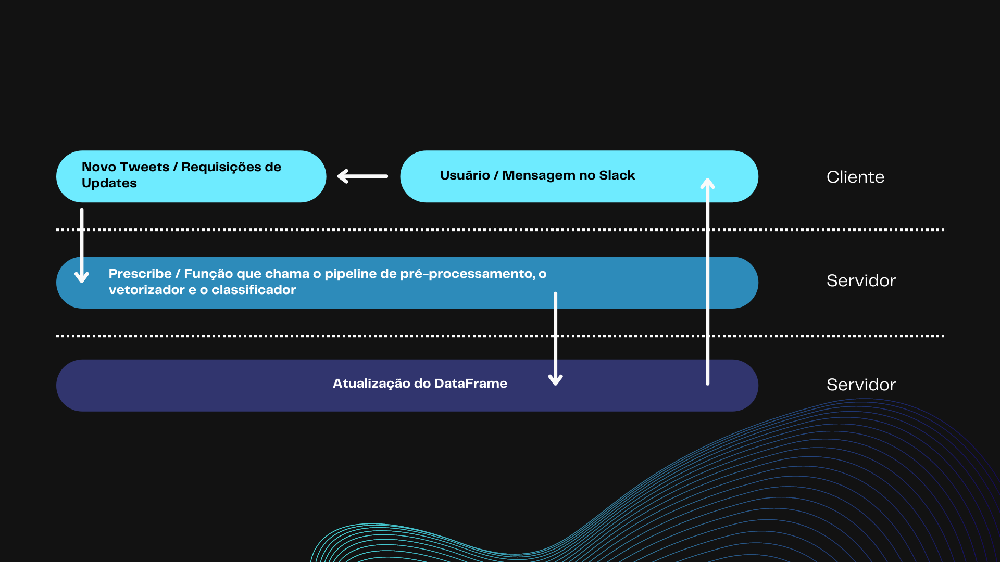
</div>

<h6 align="center"> Fonte: Elaborado pelo grupo Foster </h6>

&emsp;&emsp;Na imagem acima, temos três seções que representam as camadas/etapas do processo de classificação dos tweets recebidos. De cima para baixo, a primeira camada é denominada 'cliente', responsável por enviar a requisição que será processada e respondida pelas camadas de 'servidor'. Agora que entendemos como as camadas, separadas por divisórias e cores diferentes, funcionam, vamos nos aprofundar em cada uma delas.

&emsp;&emsp;Primeiramente, na camada de cliente, o processo começa com a entrada de um novo tweet na base. Esse tweet faz uma requisição ao servidor, descendo para a segunda camada (a primeira de servidor), onde é processado pela nossa função principal chamada 'Prescribe'. Essa função invoca diversas outras funções para processar, classificar o tweet e atualizar o dataframe, que se encontra em uma camada ainda mais abaixo. Finalmente, se necessário, uma notificação é enviada ao usuário final via Slack, retornando à camada de cliente.
 
## <a name="c10.2"></a>10.2. Métodos

&emsp;&emsp;Os métodos de desenvolvimento da API envolveram as seguintes etapas:

- **Definição das Rotas**: Implementação das rotas necessárias para a funcionalidade do projeto.
- **Configuração do Flask**: Configuração do ambiente Flask para servir a API.
- **Carregamento de Modelos**: Utilização de bibliotecas como `gensim` para carregar o modelo Word2Vec e `joblib` para carregar os pipelines pré-treinados.
- **Tratamento de Requisições**: Implementação das funções para tratar as requisições recebidas nas rotas definidas.
- **Processamento de Texto**: Aplicação dos modelos de NLP para processar e transformar o texto conforme necessário.
- 
## <a name="c10.3"></a>10.3. Resultados

&emsp;&emsp;Os testes foram realizados utilizando a ferramenta Postman, e todas as requisições retornaram com sucesso. Abaixo estão os resultados detalhados dos testes para cada endpoint.

**Teste 1: Endpoint `/pipeline`**

Requisição:
```http
GET /pipeline?text=i%20hate%20uber%20so%20much
```

Resposta:
```json
{
    "tokens": "i, hate, uber, so, much"
}
```

Status: Sucesso

**Teste 2: Endpoint `/w2v`**

Requisição:
```http
GET /w2v?tokens=[hate,uber,so,much]
```

Resposta:
```json
{
    "hate": [0.43798828125, 0.1256103515625, 0.019378662109375, ...],
    "uber": [0.220703125, -0.4202880859375, 0.018798828125, ...],
    "so": [0.720703125, -0.401611328125, 0.6805419921875, ...],
    "much": [0.08544921875, -0.552490234375, -0.4202880859375, ...]
}
```

Status: Sucesso

**Teste 3: Endpoint `/model`**

Requisição:
```http
GET /model?vectors=[0.43798828125,0.1256103515625,0.019378662109375,...]
```

Resposta:
```json
{
    "prescription": "resultado da prescrição"
}
```

Status: Sucesso

**Teste 4: Endpoint `/prescribe`**

Requisição:
```http
GET /prescribe?text=I%20hate%20uber%20so%20much
```

Resposta:
```json
{
    "prescription": "resultado da prescrição"
}
```

Status: Sucesso

## <a name="c10.4"></a>10.4. Análise

&emsp;&emsp;A API desenvolvida mostrou-se eficiente e funcional, cumprindo todos os requisitos estabelecidos para o processamento de linguagem natural. Os endpoints permitem a transformação de texto em tokens, a vetorização desses tokens e a prescrição com base nesses vetores. O uso do Flask provou ser uma escolha adequada para a criação e disponibilização das rotas, facilitando a interação com os modelos pré-treinados e os pipelines.

&emsp;&emsp;A documentação fornecida permite uma fácil compreensão de como utilizar a API, e os resultados dos testes validam a eficácia das implementações realizadas. Com base nos testes realizados, a API está pronta para uso em produção, proporcionando uma ferramenta robusta para o processamento de linguagem natural.

# <a name="c11"></a>11. Diagrama UML da solução

&emsp;&emsp;Nessa sessão será abordado como é a arquitetura de implantação da solução, que mostra a configuração física de hardware e software de um sistema. Ele ilustra como os componentes do software são implantados nos componentes de hardware, e a relação entre esses componentes. Com essas informações a manutenção e escalabilidade são facilitadas por ter representado essas relações de maneira clara.<p>

&emsp;&emsp;Considerando a definição, a imagem 15 apresenta a representação do proejto por meio do diagrama de implantação:<p>

<h6 align="center"> Imagem 15: Diagrama de Implantação </h6>

<div align="center">
	
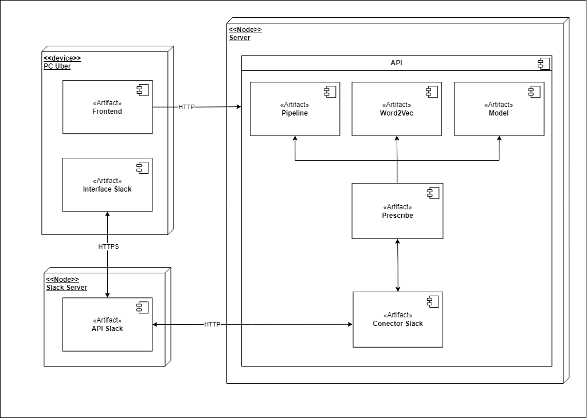
	
</div>

<h6 align="center"> Fonte: Elaborado pelos autores </h6>

&emsp;&emsp;O fluxo do diagrama começa quando o usuário da Uber através do "PC Uber" faz uma requisição HTPP para a API, onde envia o input de texto no qual quer ter po sentimento analisado. Após esse processo, o artefato "Precribe" faz a conexão das etapas necessárias para a transformação do texto inserido para a predição, sendo o primeiro o "Pipeline" que faz o pré-processamento desse input que então passa para a vetorização no artefato "Word2Vec", que então é passado para o modelo que retorna a sua classificação.<p>

&emsp;&emsp;Uma vez que a predição é feita, ela é passada para o "Conector Slack", que faz a ponte entre a API do projeto e a do Slack. Após a informação ser passada para a API do Slack, ele retorna para o usuário da Uber na sua interface do Slack de acordo com as configurações fornecidas. É importante mencionar que desde o primeiro contato com o Slack tem-se a preocupação de ter o retorno sobre a integridade da comunicação, a fim de evitar erros e acarretar na espera excessiva do usuário ou a não chegada da informação.<p>

# <a name="c12"></a>12. Deploy

&emsp;&emsp;O deploy é o processo de disponibilizar um aplicativo, serviço ou modelo de machine learning para ser acessado por outros usuários ou sistemas através da internet. Este processo é essencial para garantir que o aplicativo ou modelo esteja operacional em um ambiente de produção, onde possa ser utilizado de forma contínua e confiável. Neste documento, detalhamos o processo de deploy de dois serviços específicos: a API de Alerta no Slack usando Render e a API do modelo de classificação de sentimentos utilizando HuggingFace.

## <a name="c12.1"></a>12.1 Alerta no Slack

### <a name="c12.1.1"></a>12.1.1 Render

&emsp;&emsp;Render é uma plataforma de cloud computing que simplifica o deploy de aplicativos web, APIs e outros serviços. Ela oferece uma interface intuitiva e automação para construir e escalar aplicações sem a necessidade de gerenciar infraestrutura complexa. Render suporta várias linguagens de programação e frameworks, proporcionando um ambiente flexível e escalável.

**Configuração do Ambiente:**
- **Ferramentas Utilizadas:** Render, Slack API.
- **Pré-requisitos:** Contas no Render e Slack, chaves de API do Slack.

**Passos para o Deploy:**
1. **Criar uma conta no Render:** Acesse o site do Render e crie uma conta.
2. **Criar um novo serviço web:** No painel do Render, selecione a opção para criar um novo serviço web, escolhendo a tecnologia apropriada (por exemplo, Node.js, Python).
3. **Conectar o repositório:** Conecte seu repositório de código (por exemplo, GitHub) onde está o código da API de Alerta. Isso permite que o Render faça o deploy diretamente do seu repositório.
4. **Configurar variáveis de ambiente:** Adicione as variáveis de ambiente necessárias, como chaves de API do Slack, tokens de autenticação, URLs de callback, entre outras.
5. **Iniciar o deploy:** Clique em "Deploy" para iniciar o processo. O Render cuidará da instalação de dependências, configuração do ambiente e publicação da API.

### <a name="c12.1.2"></a>12.1.2 Métodos

1. **Evento "app_home_opened":** Atualiza a aba inicial do aplicativo no Slack.
   - **Função:** `update_home_tab`
   - **Descrição:** Quando um usuário abre a aba inicial do aplicativo no Slack, esta função personaliza a mensagem de boas-vindas e fornece instruções de uso.

2. **Comando "/prescribe":** Executa a análise de sentimento do texto fornecido pelo usuário.
   - **Função:** `predict_command`
   - **Descrição:** Quando um usuário digita o comando `/prescribe` seguido de um texto, esta função envia o texto para a API de classificação de sentimentos, recebe a previsão e a exibe no Slack.

### <a name="c12.1.3"></a>12.1.3 Resultados

- **Evento "app_home_opened":**
  - O usuário vê uma mensagem de boas-vindas personalizada e instruções sobre como usar o aplicativo.
  - Exemplo: "Welcome home, @usuario :house:"

- **Comando "/prescribe":**
  - **200 OK:** O texto é analisado com sucesso e o resultado é exibido no Slack.
    - Exemplo: "Resultado: Positive :white_check_mark: Concluído!"
  - **Erro de Requisição:** Caso ocorra um erro durante a requisição à API de sentimento.
    - Exemplo: ":x: Erro ao processar: texto\n> detalhes do erro"

## <a name="c12.2"></a>12.2 Modelo de Classificação

### <a name="c12.2.1"></a>12.2.1 HuggingFace

&emsp;&emsp;HuggingFace é uma plataforma renomada por sua biblioteca de processamento de linguagem natural (NLP) e repositório de modelos de machine learning. Ela oferece ferramentas para treinar, compartilhar e deployar modelos, facilitando o uso de modelos de NLP em aplicações práticas. A HuggingFace também possui uma interface intuitiva para gerenciar e testar modelos.

**Configuração do Ambiente:**
- **Ferramentas Utilizadas:** HuggingFace, Python.
- **Pré-requisitos:** Conta no HuggingFace, modelo treinado e disponível no HuggingFace Model Hub.

**Passos para o Deploy:**
1. **Criar uma conta no HuggingFace:** Acesse o site do HuggingFace e crie uma conta.
2. **Upload do modelo:** Faça o upload do seu modelo treinado para o HuggingFace Model Hub. Isso pode ser feito através da interface web ou usando a biblioteca Transformers para publicar o modelo diretamente de um script Python.
3. **Configurar a API:** No painel do HuggingFace, configure a API para o seu modelo, definindo os endpoints e parâmetros necessários. Isso inclui configurar as entradas e saídas esperadas do modelo.
4. **Obter a chave da API:** Gere uma chave de API no HuggingFace para poder acessar seu modelo via API.

### <a name="c12.2.2"></a>12.2.2 Métodos

1. **GET /prescribe:** Retorna a previsão baseada no texto fornecido.
   - **Função:** `prescribe`
   - **Descrição:** Este endpoint recebe um texto como entrada, processa-o usando o modelo de classificação de sentimentos hospedado no HuggingFace, e retorna a previsão (Negativo ou Não-negativo) juntamente com um visual HTML.

### <a name="c12.2.3"></a>12.2.3 Resultados

- **GET /prescribe:**
  - **200 OK:** A previsão é realizada com sucesso, retornando "Negativo" ou "Não-negativo" e um visual HTML correspondente.
  - **400 Bad Request:** Se o texto fornecido estiver vazio ou inválido.
    - Exemplo: {"error": "No text provided"}

## 12.3 Conclusão

&emsp;&emsp;Nesta seção, detalhamos o processo de deploy de dois serviços: a API de Alerta no Slack usando Render e a API do modelo de classificação de sentimentos utilizando HuggingFace. Para cada serviço, abordamos a configuração do ambiente, os métodos disponíveis e os resultados esperados. O deploy foi realizado com sucesso, permitindo a integração entre as APIs e garantindo que os alertas no Slack e as previsões do modelo possam ser acessados de forma íntegra.

# <a name="c13"></a>13. Conclusão e Plano de Ações Futuras

&emsp;&emsp;A Uber identificou uma lacuna na automatização de seus processos de monitoramento das mídias sociais, em particular do Twitter. Para atender a essa necessidade, o grupo criou a solução denominada EMOTION, que transmite a ideia de dinamismo e emoções, refletindo a essência do conteúdo produzido.

&emsp;&emsp;A EMOTION é uma API desenvolvida com base no processamento de linguagem natural, responsável pela manipulação e classificação dos textos extraídos dos comentários do Twitter em categorias de negativos e não-negativos. E então, essas classificações são encaminhadas à equipe de comunicação e marketing da Uber por meio de alertas no Slack.

&emsp;&emsp;Como modelo classificador, foi adotado o BERT, responsável por analisar e categorizar os textos em negativos e não negativos de forma eficiente e precisa.

&emsp;&emsp;E quanto à eficácia da solução para o público-alvo, o processo é simplificado: os colaboradores da Uber podem solicitar a classificação de uma frase ao robô, que fornecerá o sentimento associado a ela de maneira direta e imediata.

## Plano de Ações Futuras

&emsp;&emsp;Abaixo teremos algumas sugestões de implantações futuras divididas entre curto, médio e longo prazo:

### Curto 
- Treinar a solução com uma base de dados mais robusta e com menos vieses; 
- Criar um banco de dados e automatizar os alertas no slack de forma com que seja enviado um relatório de hora em hora.

### Medio 
- Desenvolver um frontend para a solução com métricas em tempo real para uma analise mais assertiva dos dados processados; 

### Longo
- Integrar a EMOTION com uma solução de scrapping de dados em tempo real para não perder a agilidade nas respostas de marketing;
- Escalar o nosso modelo BERT para um llm que suporta mais dados e tem um desempenho melhor do que o atual.

E com esses pontos fecha-se a documentação do projeto EMOTION para a Uber. 

# <a name="c14"></a>14. Referências

ALURA. Guia de NLP - conceitos e técnicas. Disponível em: <https://www.alura.com.br/artigos/guia-nlp-conceitos-tecnicas>. Acesso em: 7 maio. 2024.

ALURA. Lemmatization vs. stemming: quando usar cada uma? Disponível em: <https://www.alura.com.br/artigos/lemmatization-vs-stemming-quando-usar-cada-uma>. Acesso em: 7 maio. 2024.

AWS. O que é uma API? – Explicação sobre interfaces de programação de aplicações. Disponível em: <https://aws.amazon.com/pt/what-is/api/>. Acesso em: 4 jun. 2024.

KIM, W. Chan, 1951-. A estratégia do oceano azul: como criar novos mercados e tornar a concorrência irrelevante. Rio de Janeiro: Sextante, 2019. 288p., il. ISBN 9788543105888.

NEVES, João Carvalho das. ANÁLISE E RELATO FINANCEIRO: uma visão integrada de gestão. Lisboa: Texto Editores, 2012.

Mariano, Diego César, B. et al. Data Mining. Disponível em: Minha Biblioteca, Grupo A, 2021.

Martins, Júlio, S. et al. Processamentos de Linguagem Natural. Disponível em: Minha Biblioteca, Grupo A, 2020.

Mikolov et al. Efficient Estimation of Word Representations in Vector Space. (2013)

KUNUMI. Métricas de avaliação em machine learning: classificação. Medium, 17 jul. 2020. Disponível em: <https://medium.com/kunumi/m%C3%A9tricas-de-avalia%C3%A7%C3%A3o-em-machine-learning-classifica%C3%A7%C3%A3o-49340dcdb198>. Acesso em: 20 maio 2024

MIKOLOV, T. et al. Efficient Estimation of Word Representations in Vector Space. [s.l: s.n.]. Disponível em: <https://arxiv.org/pdf/1301.3781>.

VASWANI, Ashish; SHAZEER, Noam; PARMAR, Niki; USZKOREIT, Jakob; JONES, Llion; GOMEZ, Aidan N.; KAISER, Lukasz; POLOSUKHIN, Illia. Attention is All You Need. GoogleResearch, [s. l.], 2017.
‌
